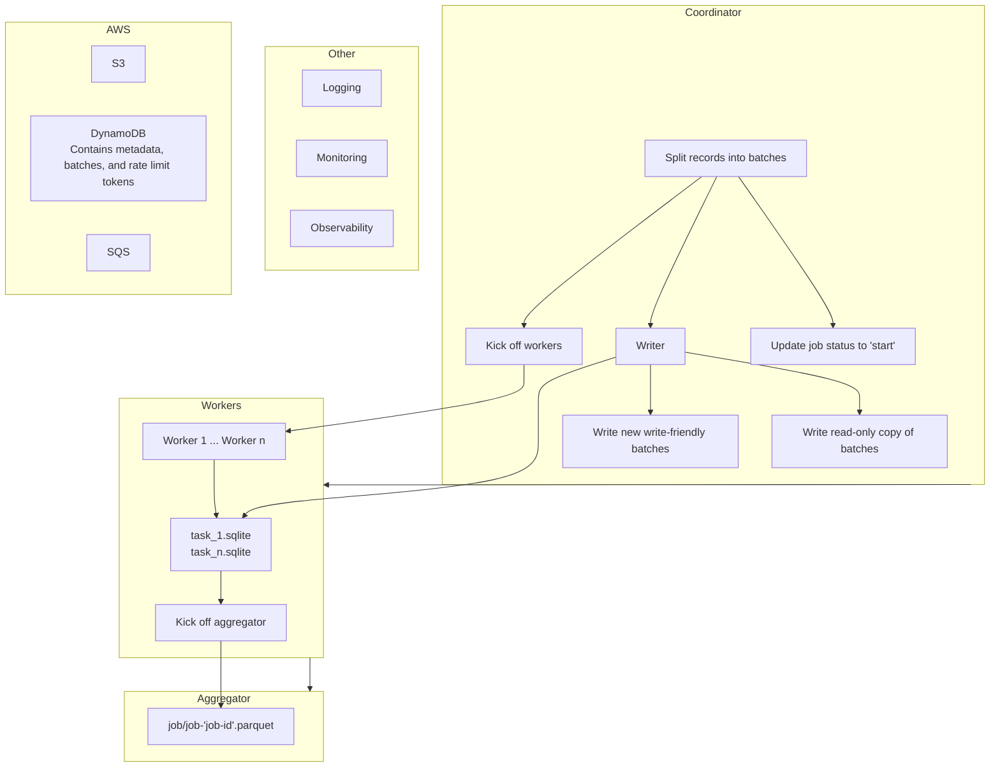

# Mermaid diagram of proposed design.

```mermaid
flowchart TD
    A --> B
    A --> A2
    A --> J
    A2 --> K
    A2 --> I
    A2 --> F
    B --> C
    %% F --> G
    P --> E
    K --> P
    %% P --> H
    %% E --> G
    %% E --> H
    C --> K
    %% J --> H
    %% I --> H
    %% C --> H
    G[S3]
    H[DynamoDB<br/>Contains metadata, batches, and rate limit tokens]
    H2[SQS]

    subgraph Coordinator
        direction TB
        A[Split records into batches]
        A2[Writer]
        B[Kick off workers]
        F[Write read-only copy of batches]
        I[Write new write-friendly batches]
        J[Update job status to 'start']
    end

    subgraph Workers
        direction TB
        C[Worker 1 ... Worker n]
        K[task_1.sqlite<br/>task_n.sqlite]
        P[Kick off aggregator]
    end

    subgraph Aggregator
        direction TB
        E[job/job-'job-id'.parquet]
    end

    subgraph Other
        L[Logging]
        M[Monitoring]
        N[Observability]
    end

    subgraph AWS
        G
        H
        H2
    end

    Coordinator --> Workers
    Workers --> Aggregator
```