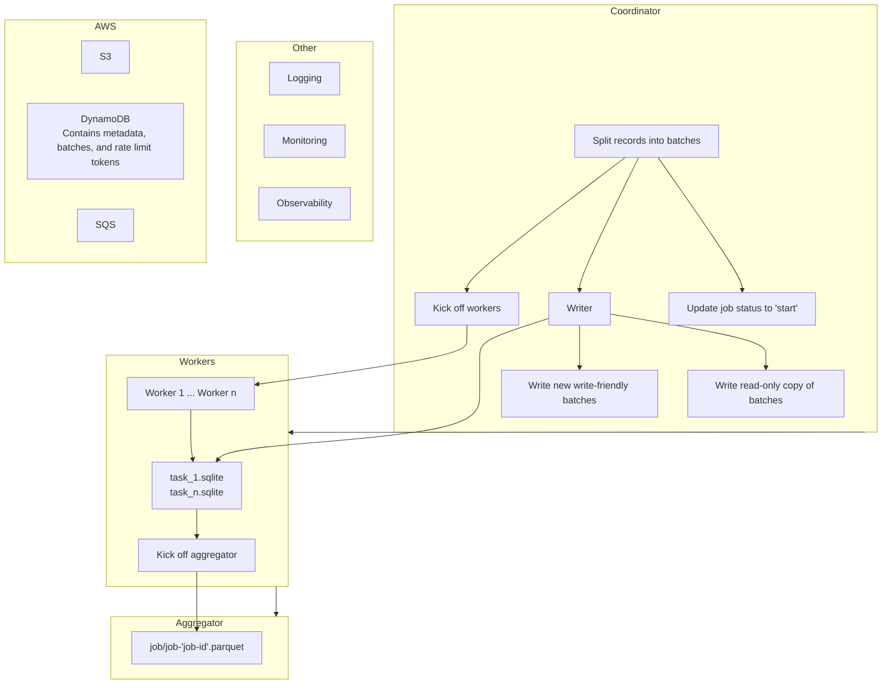

# Revisions to the initial V1 plan + additional notes

## Mermaid diagram of proposed architecture



## Architecture notes

- Can have a coordinator create "n" tasks and assign the DIDs to a "task_dids_{task_id}.json" file, and then have the serverless compute job read that file.
- Here's the nomenclature and terminology that I'll adopt:
  - `Job`: One submission of a distributed workflow. For example, I'll "submit a backfill job", and it triggers the coordinator, workers, and aggregator, with the objective of accomplishing the "complete the backfill" goal.
    - Has a unique `job_id`
    - `JobDefinition`:  config/template (e.g., in `jobs/backfill/config.yaml`)
    - `JobRun` = one execution instance (e.g., `backfill-2025-04-12`)
  - `Task`: a unit of execution.
    - Two types of tasks:
      - **Worker task (aka "processing task")**: batch handler for a slice of the data
      - **System task**: Coordinator, Retry Planner, Aggregator, etc.
    - Namespace task types for clarity:
      - Example:
            ```yaml
            type: worker
            task_id: task-0042
            role: worker
            job_id: backfill-2025-04-12
            ```
    - Suggested metadata for each task:

        ```json
            {
            "task_id": "task-0042",
            "job_id": "backfill-2025-04-12",
            "phase": "phase_1_backfill",
            "group": "initial_batch",
            "role": "worker",
            "batch_id": "batch-0042",
            "status": "SUCCESS",
            "retries": 0
            }
        ```

  - `Batch`: the abstraction representing **data partitioning**. A data slice (e.g., list of 100 users) to be processed by one task.
    - A batch represents the data, while a task represents the execution that processes a batch.
    - This setup reflects how Spark, Flink, and Dask draw a clear line between logical planning (e.g., RDD/DataFrame partition) and physical execution (task on executor), which means that this is a good framework to use for distributed systems.
  - `Role/Task_Type`: The category that a task falls into.
    - Examples include:
      - coordinator
      - worker
      - aggregator
      - retry
    - Allows us to categorize tasks easily in dashboards, logs, and monitoring systems
  - `TaskGroup/Phase`: groupings of work.
    - `TaskGroup`: A collection of tasks with the **same role and configuration**.
      - Grouping is useful for retry tracking, error analysis, and monitoring per-group throughput.
      - In one job, we could have:
        - TaskGroup `initial_batch`: Worker tasks processing the first version of the batches
        - TaskGroup `retry_batch_1`: First pass over failed tasks (taking the failed ones and respawning new tasks to execute them).
        - TaskGroup `retry_batch_2` (up to `retry_batch_{n}`): Second (or "n") pass over failed tasks.
        - TaskGroup `final_aggregation`: System tasks grouped together to do aggregation.
    - `Phase`: A high-level portion of the job, often sequential. This is used in complex pipelines where some phases depend on the previous ones being complete.
      - Example:
        - PhaseID `phase_1_backfill`: Tasks include coordinator and initial workers.
        - PhaseID `phase_2_retry`: Tasks include all retries.
        - PhaseID `phase_3_aggregate`: Tasks include aggregator + dashboard generator.
      - In this example, PhaseID `phase_1_backfill`, which encompasses the TaskGroup `coordinator` and TaskGroup `initial_batch`, needs to be done before PhaseID `phase_2_retry` (consisting of TaskGroup `retry_batch_1` up to `retry_batch_n`). Then, after PhaseID `phase_2_retry` is finished, we can run `phase_3_aggregate`.
    - Another example of phases: Let’s say we have a job that needs to backfill 1 million users.
      - Phase 1: Initial Batch Backfill
        - TaskGroup `coordinator` and `initial_batch`
        - 10,000 tasks created (each for 100 users).
        - All jobs submitted as one Slurm array job (or however we end up submitting them, e.g., we can do it as a staggered set of jobs instead of one Slurm array job).
        - All write results to S3/DynamoDB (for `coordinator`) and then local SQLite and temp .parquet (for `initial_batch`).
      - Phase 2: Retry
        - TaskGroup `retry_batch_1` to `retry_batch_{n}`
        - Read failed task IDs from DynamoDB.
        - Generate new task definitions (same batch size).
        - Only resubmit the failed batches.
        - Label these tasks in the manifest as `retry_batch_1` (or `retry_batch_{n}`).
      - Phase 3: Aggregation
        - TaskGroup `final_aggregation`
        - Single task (or parallel ones) that reads .sqlite or .parquet files
        - Writes final manifest and optionally triggers dashboard generation
  - `Manifest`: Metadata record describing job structure and artifacts.
    - Types of manifests for the pipeline:
      - **Job Manifest**: Describes an entire job run — inputs, config, handlers, outputs
        - s3 path: `s3://bucket/jobs/<job_id>/manifest.json`
        - Example:

        ```json
            {
            "job_id": "backfill-2025-04-12",
            "job_type": "backfill",
            "handler": "jobs.backfill.handler",
            "git_commit": "a3c123f",
            "config_file": "jobs/backfill/config.yaml",
            "input_file": "s3://bucket/input/users-2025-04-12.jsonl",
            "batch_size": 100,
            "task_count": 10000,
            "slurm_array_id": "123456",
            "submitted_at": "2025-04-12T12:00:00Z",
            "submitted_by": "<email>",
            "phases": [
                "initial",
                "retry_batch_1",
                "aggregation"
            ],
            "status": "RUNNING"
            }
        ```

      - **Task Manifest**: Describes one worker task — batch ID, inputs, outputs, errors
        - s3 path: `s3://bucket/jobs/<job_id>/tasks/<task_id>/manifest.json`
        - Example:

        ```json
            {
            "job_id": "backfill-2025-04-12",
            "task_id": "task-0042",
            "batch_id": "batch-0042",
            "role": "worker",
            "phase": "initial",
            "group": "initial_batch",
            "input_s3": "s3://bucket/jobs/backfill-2025-04-12/tasks/batch-0042.json",
            "output_file": "/scratch/job-2025-04-12/task-0042.sqlite",
            "status": "SUCCESS",
            "start_time": "2025-04-12T12:05:00Z",
            "end_time": "2025-04-12T12:07:22Z",
            "metrics": {
                "users_processed": 100,
                "api_requests": 153
            },
            "error": null
            }
        ```

      - **Result Manifest**: Describes output files for aggregation, success/failure state
        - s3 path: `s3://bucket/jobs/<job_id>/tasks/<task_id>/results.parquet`
        - s3 path: `s3://bucket/jobs/<job_id>/tasks/<task_id>/results.done`
        - NOTE: we'll probably download these locally, so the filepath would be
        whatever is the local equivalent.
        - Example:

        ```json
            {
            "job_id": "backfill-2025-04-12",
            "batch_id": "batch-0042",
            "file": "s3://bucket/results/backfill-2025-04-12/batch-0042.parquet",
            "status": "DONE",
            "row_count": 100,
            "sha256": "89fc23a...",
            "written_at": "2025-04-12T12:09:00Z"
            }
        ```

      - **Retry Manifest**: Tracks failed tasks and retry logic.
        - s3 path: `s3://bucket/jobs/<job_id>/retries/<retry-1>/manifest.json`
        - Example:

        ```json
            {
            "retry_id": "retry-batch-1",
            "parent_job_id": "backfill-2025-04-12",
            "failed_tasks": [
                "task-0039",
                "task-0071",
                "task-0094"
            ],
            "error_types": {
                "rate_limit": 2,
                "timeout": 1
            },
            "retries_launched": 3,
            "submitted_at": "2025-04-12T13:00:00Z"
            }
        ```

      - **Aggregator Manifest**: Logs files ingested, row counts, deduplicated state
        - s3 path: s3://bucket/jobs/<job_id>/aggregation/manifest.json
        - Example:

        ```json
            {
            "job_id": "backfill-2025-04-12",
            "phase": "aggregation",
            "input_files": [
                "s3://bucket/results/.../batch-0041.parquet",
                "s3://bucket/results/.../batch-0042.parquet"
            ],
            "output_file": "s3://bucket/final/backfill-2025-04-12.parquet",
            "total_rows": 500000,
            "output_hash": "34923fa...",
            "row_counts_by_batch": {
                "batch-0041": 250000,
                "batch-0042": 250000
            },
            "written_at": "2025-04-12T15:30:00Z"
            }
        ```

    - Manifest integration plan:
      - 🔧 Coordinator:
        - Write a job manifest at job submission
        - Write each batch’s task manifest when task is launched
      - 🧑‍🏭 Worker:
        - Write or update its task manifest upon exit (success or failure)
        - Log metrics, output file paths
      - 📦 Aggregator:
        - Log input files + total row counts
        - Verify all .done manifests exist before merging
      - 🔁 Retry Planner:
        - Read from task manifests or DynamoDB
        - Write retry manifest for traceability

    - Probably can be managed with, say, a Python utility class like `ManifestWriter`.

- So, given this vocabulary, I can say “When I submit a job, I launch a collection of tasks (of various roles: coordinator, workers, aggregator) to process batches of data. Each task operates independently and is responsible for updating shared state, respecting rate limits, and contributing results to the final dataset.”

- Maybe since I now have a "/scratch" path, I can have a "/scratch/job_{job_id}/task_{task_id}/" path, where I store all my data.

- Can probably start with the coordinator script (probably need one per job, e.g., `backfill` versus `preprocessing`). This can generate the batches and write to S3. It can, for example, possibly write the data as a single .jsonl file to S3, where each dict has the data?
  - Maybe I can enforce a handler template that has a "coordinator" method and a "worker" method (unless I want to create a "coordinator.py" and a "worker.py" for each of the jobs?)
- When I export the batches, I can write two copies, a read-only copy to S3 and then a copy to DynamoDB that is consistently updated by each task as it runs.
- I'm ostensibly treating HPC compute as AWS lambdas, since it'll be used as stateless serverless compute. This makes the architecture easy to generalize.
- Eventually, I could package up the code via Docker and use Docker + serverless compute (HPC or lambdas).
- I think that I can use AWS for state info and some metadata and logging (the logging that I want to visualize and track). I can use local storage for both the temporary .sqlite data for each task (something like `/scratch/job/<job_id>/task/<task_id>/<task_id>.sqlite` for the task-specific queues, and then, for the intermediate .parquet files during hierarchical aggregation, something like `/scratch/job/<job_id>/task/<task_id>/<task_id>_<hash>.parquet`) and then the eventual permanent data (where I currently store the permanent .parquet files).
- I'll implement a rate limiter with DynamoDB. See ChatGPT for a good implementation. The coordinator can "hand out" tokens to each worker, and then each worker maintains its local tokens, periodically checking DynamoDB if it needs a new allocation.
- The final aggregator can merge in batches recursively. For example, if there are 1,000 batches of 5,000 results each, the aggregator can first merge the 1,000 batches into 100 batches by taking 10 batches at a time. It can then merge these 100 batches into 10, and then from 10 to 1.
- TODO: I'll have to think closely about how to implement the retry strategy, still unsure of how to implement this. One possibility is this:
  - If a DID has been deleted according to the PDS, we don't want to retry this. We'll write this to a  "deleted_dids" list that I'll reference later (this may be write-heavy, so maybe I can use DynamoDB for this.  Or I can push these to SQS and then write in S3 after the tasks are finished and concurrently with the aggregation job).
  - If a DID fails and we want to retry it, we can push this to an SQS queue. We can then, in the same job as above, write those failed DIDs to S3. We can then trigger a retry job with the coordinator to trigger the tasks once more.
- For the aggregator, I want my .parquet writes to be transactional, so I'll write the .parquet files and then validate them as valid parquet (could possibly add other validation here as well). I'll write a ".done" marker file (e.g., for "task-1.parquet", I'll write a "task-1.done" file), and downstream processes (e.g., subsequent aggregations, in the hierarchical aggregation framework) only process the files that have a corresponding "*.done" marker.
- Another optimization for the aggregator is, instead of reading all the .sqlite files into one dataframe in memory, to explore something like `pyarrow.dataset`, which should be much more optimized.
