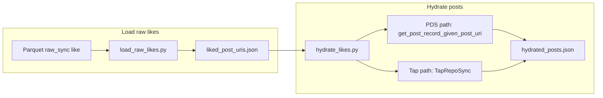

# Add Tap experiment: hydrate liked posts from raw_sync

## Overview

We have like records in the DB (raw_sync, `record_type="like"`) with a `subject` field that contains the **liked post URI** (`at://DID/app.bsky.feed.post/RKEY`). The goal is to (1) load ~20 such liked post URIs from local parquet, (2) hydrate them to full post records, and (3) optionally use Bluesky's Tap for sync-style hydration. The experiment lives in `experiments/2026-02-24_tap_experiments/` with scripts `load_raw_likes.py`, `hydrate_likes.py`, and a `TapRepoSync` class (e.g. in `tap_client.py`).

## Problem / motivation

We want to evaluate [Tap](https://docs.bsky.app/blog/introducing-tap) for getting fully hydrated posts for likes we already have in the DB. We have like URIs (and liked-post URIs via `subject`) in raw_sync parquet; we need a small, runnable experiment that loads a sample of liked post URIs and hydrates them via either the existing PDS API or Tap.

## Solution

Add a self-contained experiment under `experiments/2026-02-24_tap_experiments/`: load ~20 liked post URIs from raw_sync likes, then hydrate via `--method pds` (existing `get_post_record_given_post_uri`) or `--method tap` (TapRepoSync: connect to Tap WebSocket, add DIDs, consume events until requested URIs are received). Tap runs as a separate process (indigo repo); clone in repo root and run `go run ./cmd/tap run --disable-acks=true`.

## Happy Flow

1. **Load raw likes** – `load_raw_likes.py` calls `load_data_from_local_storage` with `service="raw_sync"`, `custom_args={"record_type": "like"}`, `storage_tiers=[StorageTier.CACHE, StorageTier.ACTIVE]`, and study date range. Parses `subject` via `json.loads(row["subject"])["uri"]`, deduplicates by liked post URI, takes 20 URIs, writes `liked_post_uris.json`.

2. **Hydrate (PDS path)** – `hydrate_likes.py` reads `liked_post_uris.json`, calls `get_post_record_given_post_uri` per URI, writes `hydrated_posts_pds.json`.

3. **Hydrate (Tap path)** – Same script with `--method tap`: extract DIDs from post URIs, connect to Tap WebSocket first, then `POST /repos/add` with DIDs; consume events (indigo format: `type: "record"`, `record.did`/`collection`/`rkey` → URI, `record.record` → post body) until all requested URIs or timeout. Writes `hydrated_posts_tap.json`. Tap must be running (`cd indigo && go run ./cmd/tap run --disable-acks=true`).

4. **TapRepoSync** – `tap_client.py`: `add_repos(dids)`, `connect()`, `stream_events()`, `wait_for_posts(post_uris, timeout_sec, dids_to_add=...)` (connect before add so backfill events are not missed).

## Data Flow

## Changes

- `experiments/2026-02-24_tap_experiments/load_raw_likes.py`: load raw_sync likes, parse `subject.uri`, write up to 20 URIs to `liked_post_uris.json`.
- `experiments/2026-02-24_tap_experiments/hydrate_likes.py`: read `liked_post_uris.json`; `--method pds` (PDS per URI) or `--method tap` (TapRepoSync); write `hydrated_posts_pds.json` / `hydrated_posts_tap.json`.
- `experiments/2026-02-24_tap_experiments/tap_client.py`: `TapRepoSync` (add_repos, connect, stream_events, wait_for_posts with connect-before-add and indigo event parsing); `extract_did_from_post_uri`.
- `experiments/2026-02-24_tap_experiments/README.md`: run order, Tap clone/run (indigo, `go run ./cmd/tap run --disable-acks=true`), plan asset path.
- `docs/plans/2026-02-24_tap_experiments_7f3a2e/`: plan copy and verification notes (Tap run results, 16/20 hydrated via both PDS and Tap).
- `.gitignore`: add `indigo/` so Tap clone is not committed.

## Manual Verification

- **Data exists:** raw_sync like parquet under `root_local_data_directory/raw_sync/create/like/` for the study date range (or hand-write `liked_post_uris.json` for testing).
- **Load:** `uv run python experiments/2026-02-24_tap_experiments/load_raw_likes.py` → "Wrote 20 liked post URIs to .../liked_post_uris.json"; file is JSON array of strings.
- **Hydrate PDS:** `uv run python experiments/2026-02-24_tap_experiments/hydrate_likes.py --method pds` → `hydrated_posts_pds.json` with one object per fetched post (e.g. 16/20; 4 repo/record not found).
- **Hydrate Tap:** Clone indigo in repo root (`git clone https://github.com/bluesky-social/indigo.git indigo`). Start Tap: `cd indigo && go run ./cmd/tap run --disable-acks=true`. Then `uv run python experiments/2026-02-24_tap_experiments/hydrate_likes.py --method tap --timeout 300` → `hydrated_posts_tap.json` (e.g. 16/20; use fresh Tap DB so backfill runs).
- **Health:** `curl -s http://localhost:2480/health` → `{"status":"ok"}` when Tap is running.
