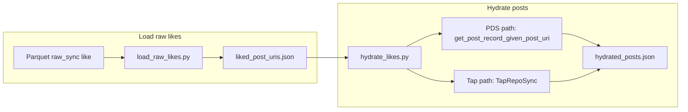

# Tap Experiments: Hydrate Liked Posts

## Remember
- Exact file paths always
- Exact commands with expected output
- DRY, YAGNI, TDD, frequent commits

## Plan asset directory

All assets for this workflow (run logs, design notes, verification notes) are stored under:

**`docs/plans/2026-02-24_tap_experiments_7f3a2e/`**

- No UI screenshots required for this experiment.
- Save any run output, Tap logs, or deviation notes there for reference.

## Overview

We have like records in the DB (raw_sync, `record_type="like"`) with a `subject` field that contains the **liked post URI** (`at://DID/app.bsky.feed.post/RKEY`). The goal is to (1) load ~20 such liked post URIs from local parquet, (2) hydrate them to full post records, and (3) optionally use Bluesky's Tap for sync-style hydration. The experiment lives in `experiments/2026-02-24_tap_experiments/` with scripts `load_raw_likes.py`, `hydrate_likes.py`, and a `TapRepoSync` class (e.g. in `tap_client.py`).

## Happy Flow

1. **Load raw likes:** [load_raw_likes.py](experiments/2026-02-24_tap_experiments/load_raw_likes.py) calls [load_data_from_local_storage](lib/db/manage_local_data.py) with `service="raw_sync"`, `custom_args={"record_type": "like"}`, `storage_tiers=[StorageTier.CACHE, StorageTier.ACTIVE]`, and a partition date range (e.g. [STUDY_START_DATE, STUDY_END_DATE](services/calculate_analytics/shared/constants.py)). It parses `subject` via `json.loads(row["subject"])["uri"]` (same as [engagement.get_content_engaged_with](services/calculate_analytics/shared/data_loading/engagement.py) for likes), deduplicates by liked post URI, takes 20 URIs, and writes them to `experiments/2026-02-24_tap_experiments/liked_post_uris.json`.

2. **Hydrate (PDS path):** [hydrate_likes.py](experiments/2026-02-24_tap_experiments/hydrate_likes.py) reads `liked_post_uris.json`, then for each URI calls [get_post_record_given_post_uri](transform/bluesky_helper.py) (or [get_record_with_author_given_post_uri](transform/bluesky_helper.py) for author+record). It writes hydrated post records to e.g. `experiments/2026-02-24_tap_experiments/hydrated_posts_pds.json`.

3. **Hydrate (Tap path, optional):** Same script (or a flag) uses [TapRepoSync](experiments/2026-02-24_tap_experiments/tap_client.py): extract DIDs from the 20 post URIs (`at://DID/...` → `DID`), call Tap `POST /repos/add` with those DIDs, connect to `ws://localhost:2480/channel`, consume events filtered by `app.bsky.feed.post`, and collect records for the requested URIs until all 20 are received or timeout. Write to e.g. `hydrated_posts_tap.json`. Tap must be running separately (e.g. `go run ./cmd/tap --disable-acks=true`).

4. **TapRepoSync class:** In [tap_client.py](experiments/2026-02-24_tap_experiments/tap_client.py): `add_repos(dids: list[str])` (HTTP `POST /repos/add`), `connect()` (WebSocket to channel), `stream_events()` generator yielding parsed events, and optionally `wait_for_posts(post_uris: set[str], timeout_sec=...)` returning `dict[str, dict]` (uri → post record).

## Manual Verification

- [ ] **Data exists:** Ensure raw_sync like parquet exists under `root_local_data_directory/raw_sync/create/like/` (cache and/or active) for the chosen date range. If missing, skip or mock the load step and use a hand-written `liked_post_uris.json` with 2–3 real at:// URIs for testing.
- [ ] **Run load script:** From repo root: `uv run python experiments/2026-02-24_tap_experiments/load_raw_likes.py`. Expect stdout or log indicating number of likes loaded and 20 URIs written; confirm `experiments/2026-02-24_tap_experiments/liked_post_uris.json` exists and is a JSON array of strings.
- [ ] **Run hydrate (PDS):** `uv run python experiments/2026-02-24_tap_experiments/hydrate_likes.py --method pds` (or equivalent). Expect `hydrated_posts_pds.json` with one object per URI (or per post record); spot-check one entry for `text`, `uri`, author.
- [ ] **Run Tap (optional):** Start Tap in another terminal (e.g. `go run ./cmd/tap --disable-acks=true` from Tap repo). Then run `uv run python experiments/2026-02-24_tap_experiments/hydrate_likes.py --method tap`. Expect `hydrated_posts_tap.json`; verify same URIs as PDS path where possible.
- [ ] **Tests (if added):** e.g. `uv run pytest experiments/2026-02-24_tap_experiments/ -v` for any unit tests on `TapRepoSync` or parsing of `subject` in load_raw_likes.

## Alternative approaches

- **Hydrate only via PDS:** We could skip Tap and only use `get_post_record_given_post_uri`. The plan includes Tap to explicitly evaluate "how well and easily" Tap works for this use case; keeping both paths allows comparison and documents Tap setup.
- **Use engagement module directly:** We could call `get_content_engaged_with(record_type="like", ...)` but that requires `valid_study_users_dids` and returns a dict keyed by post URI with engagement metadata. For a minimal experiment, loading raw_sync likes and parsing `subject` in a standalone script keeps the experiment self-contained and avoids coupling to study user sets.
- **Tap as subprocess:** The plan assumes Tap is run manually; alternatively we could spawn Tap in a subprocess from Python. Deferred to keep the first iteration simple.

## Implementation specifics

| Item | Detail |
|------|--------|
| **Experiment dir** | [experiments/2026-02-24_tap_experiments/](experiments/2026-02-24_tap_experiments/) (create if missing). |
| **Load script** | [experiments/2026-02-24_tap_experiments/load_raw_likes.py](experiments/2026-02-24_tap_experiments/load_raw_likes.py). Use `load_data_from_local_storage(service="raw_sync", storage_tiers=[StorageTier.CACHE, StorageTier.ACTIVE], start_partition_date=..., end_partition_date=..., custom_args={"record_type": "like"})`. Parse `subject` with `json.loads(df["subject"].iloc[i])["uri"]`. Output path: `experiments/2026-02-24_tap_experiments/liked_post_uris.json`. |
| **Constants import** | For date range, import `STUDY_START_DATE`, `STUDY_END_DATE` from [services/calculate_analytics/shared/constants.py](services/calculate_analytics/shared/constants.py) (e.g. `"2024-09-30"`, `"2024-12-01"`). |
| **Hydrate script** | [experiments/2026-02-24_tap_experiments/hydrate_likes.py](experiments/2026-02-24_tap_experiments/hydrate_likes.py). Read `liked_post_uris.json`; with `--method pds` call [get_post_record_given_post_uri](transform/bluesky_helper.py) in a loop; with `--method tap` use TapRepoSync. Write PDS output to `hydrated_posts_pds.json`, Tap output to `hydrated_posts_tap.json`. |
| **Tap client** | [experiments/2026-02-24_tap_experiments/tap_client.py](experiments/2026-02-24_tap_experiments/tap_client.py). Class `TapRepoSync`: base URL configurable (default `http://localhost:2480`); `add_repos(dids)` → `requests.post(f"{base}/repos/add", json={"dids": dids})`; WebSocket URL `ws://localhost:2480/channel`; parse Tap event JSON and filter by collection `app.bsky.feed.post`; `wait_for_posts(post_uris, timeout_sec)` consumes events until all URIs seen or timeout. |
| **DID extraction** | From post URI `at://did:plc:xxx/app.bsky.feed.post/yyy` the DID is the third path segment (index 2 after split by `/`). |
| **Plan asset dir** | [docs/plans/2026-02-24_tap_experiments_7f3a2e/](docs/plans/2026-02-24_tap_experiments_7f3a2e/). Store any design notes or run logs there; no UI screenshots required. |
