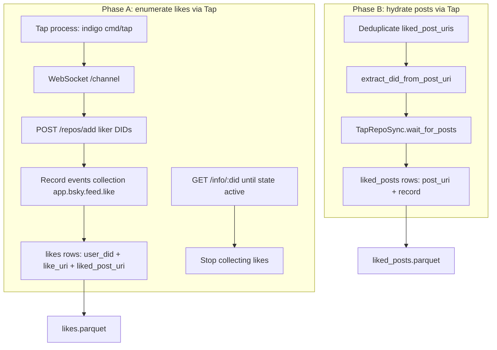

# Tap user likes and liked posts (Parquet experiment)

## Remember

- Exact file paths always
- Exact commands with expected output
- DRY, YAGNI, TDD, frequent commits
- No UI work: no screenshots required

## Plan asset directory

Store run notes, sample command output, and any Tap/`/info` response quirks under:

**[docs/plans/2026-03-24_tap_user_likes_parquet_8f4e2a/](docs/plans/2026-03-24_tap_user_likes_parquet_8f4e2a/)**

## Relation to PR 386 / prior plan

The merged work ([PR #386](https://github.com/METResearchGroup/bluesky-research/pull/386), plan [.cursor/plans/tap_experiments_hydrate_likes_9424dc57.plan.md](.cursor/plans/tap_experiments_hydrate_likes_9424dc57.plan.md)) lives under the existing tap experiment folder **[experiments/tap_experiments_2026_02_24/](experiments/tap_experiments_2026_02_24/)** (e.g. [load_raw_likes.py](experiments/tap_experiments_2026_02_24/load_raw_likes.py), [hydrate_likes.py](experiments/tap_experiments_2026_02_24/hydrate_likes.py), [tap_client.py](experiments/tap_experiments_2026_02_24/tap_client.py)).

1. **Load liked post URIs from local `raw_sync` parquet** — prior experiment assumed likes were already in your warehouse.
2. **Hydrate those posts** with PDS or Tap using `**TapRepoSync.wait_for_posts`** in [tap_client.py](experiments/tap_experiments_2026_02_24/tap_client.py) — **known** post URIs, collection `app.bsky.feed.post`.

This new task **does not** start from `raw_sync`. It starts from **explicit user DIDs** and must **discover** every like record in each user’s repo, then **hydrate** each distinct liked post. Both discovery and hydration should go through **Tap**, reusing the same HTTP (`POST /repos/add`) + WebSocket (`/channel`) approach and the [indigo Tap event shape](https://raw.githubusercontent.com/bluesky-social/indigo/main/cmd/tap/README.md) (`type: "record"`, nested `record.did` / `collection` / `rkey` / `record` / `live`).

**Indigo / Tap:** The **indigo** repo is **already present** at the workspace root (e.g. `indigo/`). Do **not** treat `git clone` as a prerequisite; operator runs Tap from that tree (e.g. `cd indigo && go run ./cmd/tap run ...`).

**Minimize extra work:** Err on **reusing** [experiments/tap_experiments_2026_02_24/tap_client.py](experiments/tap_experiments_2026_02_24/tap_client.py) — keep `**TapRepoSync`**, `**wait_for_posts**`, `**extract_did_from_post_uri**`, `**_ws_url_from_base**`, and existing post parsing as-is. Add **only** the smallest API needed for Phase A (like events + completion), e.g. `get_repo_info` + `collect_likes_for_dids` (names TBD). Avoid optional cleanups (logger `__file_`_, `DEFAULT_WS_URL`, executor for `add_repos`) **unless** implementing Phase A requires editing those lines.

Reference for like record semantics (subject URI → liked post): [RawLikeRecord](lib/db/bluesky_models/raw.py) and [get_latest_likes_by_user](services/deprecated/update_user_bluesky_engagement/helper.py) (`collection=app.bsky.feed.like`, filter subjects to `app.bsky.feed.post`).

## Overview

Build `**experiments/tap_experiments_hydrate_likes_2026_03_24/`** with a small CLI (e.g. `run_tap_user_likes.py`) that:

1. Takes the four seed DIDs (defaulting to the list you provided; overridable via CLI or a small `user_dids.json` in the experiment dir).
2. **Phase A — Likes:** Register those DIDs with Tap, connect to the WebSocket **before** `repos/add` (same race avoidance as `wait_for_posts`), consume `app.bsky.feed.like` record events for those DIDs, parse each like’s **like URI** and **liked post URI** from the inner record’s `subject.uri`. Stop when Tap reports each repo as fully tracked and the outbox has quiesced (see Happy Flow).
3. **Phase B — Liked posts:** Deduplicate liked post URIs, derive **poster** DIDs with existing `**extract_did_from_post_uri`**, call `**TapRepoSync.wait_for_posts`** (unchanged) with `collection=app.bsky.feed.post` and `dids_to_add` = poster DIDs, with a configurable timeout.
4. **Outputs:** Under the experiment’s output dir (e.g. `out/`): `**likes.parquet`** (one row per like: `user_did`, `like_uri`, plus `liked_post_uri` as needed) and `**liked_posts.parquet`** (one row per **distinct** liked post: at minimum `post_uri` and a JSON column for the Tap post body).

Use **pandas** + **pyarrow** (already in [pyproject.toml](pyproject.toml)) for `to_parquet`.

## Happy Flow

1. **Operator starts Tap** from the **existing** `indigo/` checkout (separate terminal), e.g. `go run ./cmd/tap run --no-replay --disable-acks=true` ([cmd/tap README](https://raw.githubusercontent.com/bluesky-social/indigo/main/cmd/tap/README.md)). Optionally `**TAP_COLLECTION_FILTERS=app.bsky.feed.like,app.bsky.feed.post`** to reduce noise; record handler ignores non-`type: record`.
2. **Phase A:** Implement in [tap_client.py](experiments/tap_experiments_2026_02_24/tap_client.py) **only** what is not already there — async path that opens WS, `add_repos` (via existing `TapRepoSync.add_repos` in a thread if needed), parses like events (mirror `_parse_tap_record_event` pattern for `app.bsky.feed.like`), polls `**GET /info/:did`** until `state == active`, then optional outbox quiesce. Dedupe by `**like_uri`**.
3. **Phase B:** `TapRepoSync(...).wait_for_posts(...)` — **no duplication** of post WebSocket logic in the new script beyond calling the existing method.
4. **Write Parquet** from the new experiment script only.

## Manual Verification

- **Prerequisites:** **indigo already at repo root**; Go toolchain. Tap listening: `curl -s http://localhost:2480/health` returns `{"status":"ok"}`.
- **Run:** From repo root, e.g.  
`uv run python experiments/tap_experiments_hydrate_likes_2026_03_24/run_tap_user_likes.py --output-dir experiments/tap_experiments_hydrate_likes_2026_03_24/out --timeout-posts 600`  
(exact flags TBD in implementation.)
- **Expect:** Stdout prints counts; Parquet files under `output-dir`.
- **Spot-check:**  
`uv run python -c "import pandas as pd; print(pd.read_parquet('experiments/tap_experiments_hydrate_likes_2026_03_24/out/likes.parquet').head()); ..."`
- **Edge cases:** zero post likes; large like counts; Tap at-least-once — **dedupe by `like_uri`**.

## Alternative approaches

- **PDS `listRecords` for likes, Tap only for posts:** Documented fallback if needed; primary path remains Tap for both.
- **Single WebSocket for both phases:** Possible but more complex; **recommended:** Phase A then Phase B using existing `**wait_for_posts`**.

## Specificity (files and responsibilities)

| Item               | Detail                                                                                                                                                                                                                        |
| ------------------ | ----------------------------------------------------------------------------------------------------------------------------------------------------------------------------------------------------------------------------- |
| New experiment dir | **[experiments/tap_experiments_hydrate_likes_2026_03_24/](experiments/tap_experiments_hydrate_likes_2026_03_24/)** — e.g. `run_tap_user_likes.py`, optional `user_dids.json`, output defaulting to `./out/` under that dir    |
| Tap client         | **[experiments/tap_experiments_2026_02_24/tap_client.py](experiments/tap_experiments_2026_02_24/tap_client.py)** — minimal additions for Phase A only; **reuse** `TapRepoSync`, `wait_for_posts`, `extract_did_from_post_uri` |
| Seed DIDs          | `did:plc:w5mjarupsl6ihdrzwgnzdh4y`, `did:plc:e4itbqoxctxwrrfqgs2rauga`, `did:plc:gedsnv7yxi45a4g2gts37vyp`, `did:plc:fbnm4hjnzu4qwg3nfjfkdhay`                                                                                |
| Parquet schemas    | `likes`: `user_did`, `like_uri`, `liked_post_uri`. `liked_posts`: `post_uri`, `post_json` (or equivalent)                                                                                                                     |

## Implementation todos

1. **tap-client-extensions** — Minimal extensions to [tap_client.py](experiments/tap_experiments_2026_02_24/tap_client.py) for Phase A only; reuse existing helpers for Phase B.
2. **experiment-cli** — Add [experiments/tap_experiments_hydrate_likes_2026_03_24/run_tap_user_likes.py](experiments/tap_experiments_hydrate_likes_2026_03_24/run_tap_user_likes.py): args, DIDs, Phase A → Phase B → Parquet.
3. **verification-notes** — After first successful run, notes in [docs/plans/2026-03-24_tap_user_likes_parquet_8f4e2a/](docs/plans/2026-03-24_tap_user_likes_parquet_8f4e2a/).

