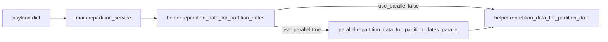

# Repartition service: implementation plan

## Remember

- Exact file paths always
- Exact commands with expected output
- DRY, YAGNI, TDD, frequent commits
- Maximum safely delegable parallelism
- Delegated tasks must be impossible to misread
- No UI scope: screenshots not required ([`services/repartition_service/`](services/repartition_service/) only)

Save a copy of this plan (and any diffs summaries) under:

`docs/plans/2026-05-10_repartition_service_847392/`

(example hash; coordinator may regenerate a unique 6-digit suffix if collision exists)

---

## Overview

The repartition service migrates partitioned local storage for a keyed service ([`MAP_SERVICE_TO_METADATA`](lib/db/service_constants.py)) by backing up partition trees, rewriting export metadata (`timestamp_field` → `new_service_partition_key`), and re-exporting via [`export_data_to_local_storage`](lib/db/manage_local_data.py). Today [`repartition_service(payload)`](services/repartition_service/main.py) forwards `use_parallel=` into [`repartition_data_for_partition_dates`](services/repartition_service/helper.py), which **does not accept that keyword**, producing a **`TypeError` on non-mocked runs**. Parallel execution exists only in [`parallel_processing.py`](services/repartition_service/parallel_processing.py) and is unreachable. This work wires the documented flag safely, adds regressions/tests, aligns docs/runbook with disk layout from [`get_service_paths`](services/repartition_service/helper.py), and optionally deduplicates dead helper wrappers in a later spine step.

---

## Happy Flow

1. Caller invokes [`repartition_service`](services/repartition_service/main.py) with `payload["service"]` and optional dates, exclusions, partition key, and `use_parallel`.
2. [`repartition_data_for_partition_dates`](services/repartition_service/helper.py) validates `service` against `MAP_SERVICE_TO_METADATA`, builds dates via [`get_partition_dates`](lib/datetime_utils.py).
3. **Sequential path (`use_parallel=False`, default):** for each partition date, [`repartition_data_for_partition_date`](services/repartition_service/helper.py): [`get_service_paths`](services/repartition_service/helper.py) → `load_data_from_local_storage` → backup + verify → temp + verify → delete original → export with overridden metadata (`timestamp_field` = new key) → [`cleanup_temp_files`](services/repartition_service/helper.py) in `finally`.
4. **Parallel path (`use_parallel=True`):** delegate to [`repartition_data_for_partition_dates_parallel`](services/repartition_service/parallel_processing.py) with same date range/service/key/exclusions so multiple dates run in worker processes **without altering per-date semantics** beyond concurrency.
5. Results map date → [`OperationResult`](services/repartition_service/helper.py); [`main`](services/repartition_service/main.py) logs completion.

---

## Alternative approaches

- **Chosen:** Add `use_parallel: bool = False` to [`repartition_data_for_partition_dates`](services/repartition_service/helper.py); when True, call [`repartition_data_for_partition_dates_parallel`](services/repartition_service/parallel_processing.py). Matches existing payload and README intent.
- **Rejected for this pass:** Removing `use_parallel` from [`main`](services/repartition_service/main.py) — would silently change advertised API.
- **Deferred (YAGNI):** Deduping inlined backup/temp/export with [`create_backup`](services/repartition_service/helper.py) / [`create_temp_copy`](services/repartition_service/helper.py) / [`export_repartitioned_data`](services/repartition_service/helper.py) until parallel path stabilizes tests (same file contention risk).

---

## Serial coordination spine

1. Freeze public contracts (below) before any branching work.
2. Implement `use_parallel` parameter and dispatch in [`helper.py`](services/repartition_service/helper.py); keep return type `Dict[str, OperationResult]`.
3. Fix [`parallel_processing.py`](services/repartition_service/parallel_processing.py) typing/signature mismatches (**`shared_state`** in [`process_date_chunk`](services/repartition_service/parallel_processing.py) must reflect `multiprocessing.Value`, not `Dict`) and ensure imports remain picklable for `ProcessPoolExecutor` (workers only call top-level `repartition_data_for_partition_date` + serializable args—verify no accidental closure captures).
4. Extend tests so `repartition_service` hits real helper signatures (avoid mocks that hide **`TypeError`**).
5. **Optional second spine milestone:** refactor `repartition_data_for_partition_date` to reuse the three helpers and delete duplication—only after green tests.

---

## Interface or contract freeze

- **Frozen:** Paths from [`get_service_paths`](services/repartition_service/helper.py) (`original` under metadata `local_prefix`; `backup`/`temp` under `root_local_data_directory` using `old_{basename(local_prefix)}` / `tmp_{basename(local_prefix)}`).
- **Frozen:** Per-date semantics: backup + verify, temp + verify, delete original only after both verify, export with copied metadata where `timestamp_field` is replaced.
- **Frozen:** Empty partition → SUCCESS with informational message and no destructive writes (current [`repartition_data_for_partition_date`](services/repartition_service/helper.py)).
- **Frozen:** [`repartition_data_for_partition_dates`](services/repartition_service/helper.py) continues past individual date failures (log + aggregate results)—unless stakeholder explicitly expands scope later.
- **Allowed change:** Adding optional parameter `use_parallel: bool = False` (backward compatible).

---

## Parallel task packets

**Important:** [`helper.py`](services/repartition_service/helper.py) must not be edited by two delegates simultaneously. Spine owns `helper.py` + wiring. After spine merges:

### Packet DOC1 — Runbook (new file)

| Field | Detail |
|--------|--------|
| **Objective** | Add operator-facing recovery and failure semantics for repartition. |
| **Parallelizable because** | New file under `docs/`, zero import coupling. |
| **Inspect** | Diagnosis notes; [`helper.py`](services/repartition_service/helper.py) `finally`/`cleanup_temp_files`; [`README.md`](services/repartition_service/README.md) |
| **Change allowed** | `docs/runbooks/services/repartition_service.md` (**create only**) |
| **Forbidden** | All `services/repartition_service/*.py`, `lib/**` |
| **Preconditions** | Contract freeze section agreed |
| **Dependencies** | None |
| **Invariants** | Rollback anchors: `backup` path under `old_*`; restore procedure spelled out clearly |
| **Steps** | Document purpose in study; local run (`PYTHONPATH=.` + example `uv run python -m services.repartition_service.main` or documented entry); dependency on data roots/env; failure modes (verify mismatch, interrupted run, parallel worker crash); escalation |
| **Verify** | `ls docs/runbooks/services/repartition_service.md` exists |
| **Expected** | Markdown file renders; references correct path keys |
| **Done when** | File committed; cross-link from README if spine adds pointer (coordinate with DOC2—who adds README “Runbook” line is **DOC2**) |
| **Coordinator review** | Accurate backup path naming; matches `get_service_paths` |

### Packet DOC2 — README corrections

| Field | Detail |
|--------|--------|
| **Objective** | Payload includes `use_parallel`; path examples match [`get_service_paths`](services/repartition_service/helper.py) + `MAP_SERVICE_TO_METADATA.local_prefix`. |
| **Parallelizable because** | Only [`README.md`](services/repartition_service/README.md) touched; no overlap with DOC1 file. |
| **Inspect** | Current [`README.md`](services/repartition_service/README.md); helper path logic ~lines 117–142 |
| **Change allowed** | [`services/repartition_service/README.md`](services/repartition_service/README.md) |
| **Forbidden** | Production `.py` in this packet |
| **Preconditions** | Contract freeze |
| **Dependencies** | Spine may merge first so README reflects actual `use_parallel` behavior (**precondition**: after spine merges) |
| **Steps** | Add `use_parallel` to snippet; clarify original path uses service `local_prefix`, not blindly `root_local_data_directory/{service}`; add single line linking to [`docs/runbooks/services/repartition_service.md`](docs/runbooks/services/repartition_service.md) |
| **Verify** | Read markdown |
| **Expected** | No stale API |
| **Done when** | README matches code |
| **Coordinator review** | Example service names plausible vs `MAP_SERVICE_TO_METADATA` keys |

### Packet TESTP — Parallel unit tests

| Field | Detail |
|--------|--------|
| **Objective** | Lock multiprocessing orchestration regressions (`process_date_chunk` counter, executor submit args, retry path stubs). |
| **Parallelizable because** | New file `[services/repartition_service/tests/test_parallel_processing.py](services/repartition_service/tests/test_parallel_processing.py)` exclusively; avoids touching `[test_repartition_main.py](services/repartition_service/tests/test_repartition_main.py)`. |
| **Inspect** | [`parallel_processing.py`](services/repartition_service/parallel_processing.py) |
| **Change allowed** | `services/repartition_service/tests/test_parallel_processing.py` (create/modify **only this test file**) |
| **Forbidden** | `helper.py`, `parallel_processing.py` (unless uncovered bug blocking tests—raise to coordinator) |
| **Preconditions** | Spine merged `Shared_state`/`Value` fixes |
| **Dependencies** | Spine |
| **Invariants** | Mock `ProcessPoolExecutor`/`Process`/`Value` rather than spawning real pools where possible |
| **Steps** | Add tests that `repartition_data_for_partition_dates_parallel` validates service, merges chunk results + retry map; monkeypatch futures |
| **Verify** | Command in Manual Verification → parallel test path |
| **Expected** | New tests green |
| **Done when** | Coverage for failure/retry markers |
| **Coordinator review** | Tests don’t flaky-spawn multiprocessing on CI |

### Packet MAINtest — Integration-style main test

| Field | Detail |
|--------|--------|
| **Objective** | Ensure [`repartition_service`](services/repartition_service/main.py) does not regress on kwargs to helper. |
| **Parallelizable because** | Only `[test_repartition_main.py](services/repartition_service/tests/test_repartition_main.py)` (**do not overlap** same test file edits with Packet TESTP—TESTP owns other file OK; this packet owns ONLY `test_repartition_main`) |
| **Preconditions** | Spine merged |
| **Steps** | Add test using `autospec=True`/`wraps` or call real `repartition_data_for_partition_dates` with storage mocked so `use_parallel=False`/`True` both exercise signature; fix any `OperationResult(error=str)` usages to satisfy typing if tightening |
| **Verify** | `uv run pytest services/repartition_service/tests/test_repartition_main.py -q --import-mode=importlib` |
| **Forbidden** | `helpers` implementation in same task as DOC packets |

*(If Coordinator assigns MAINtest + TESTP in parallel — OK — different files.)*

---

## Integration order

1. Spine merges: `helper.py` + `parallel_processing.py`.
2. In parallel after spine: DOC1 runbook | DOC2 README | MAINtest | TESTP (different files satisfy rules).
3. Optional spine 2: dedupe helpers inside `helper.py`.

---

## Manual verification checklist

From repo root, `PYTHONPATH` set like CI (`PYTHONPATH=.`) or mirror [`.github/workflows/python-ci.yml`](.github/workflows/python-ci.yml):

- [ ] `uv run pytest services/repartition_service/tests -q --import-mode=importlib` → **Expected:** all pass (baseline was 18; expect more after new tests).
- [ ] `uv run ruff check services/repartition_service/` → **Expected:** issues **0**.
- [ ] `PYTHONPATH=. uv run python -c "from services.repartition_service.main import repartition_service; repartition_service({'service':'<valid_key>','use_parallel':False})"` with **`MAP_SERVICE_TO_METADATA` + storage mocked/faked locally** → **Expected:** no `TypeError` on unexpected keyword (**note:** hitting real filesystem needs valid dataset; prefer pytest over ad-hoc unless operator has fixtures).
- [ ] Smoke parallel (optional staging): minimal two-date range with **`use_parallel=True`** on disposable copy — **Expected:** parity with sequential output counts (project-specific validation).
- [ ] Install pyright locally if absent: resolve `Failed to spawn: pyright` from prior diagnosis; run `pyright services/repartition_service/` → document pre-existing workspace issues separately.

---

## Final verification

- [ ] CI pytest list unchanged for path `services/repartition_service/tests`.
- [ ] No cross-file regressions per `grep repartition_data_for_partition_dates` callers outside service.
- [ ] Coordinator confirms README/runbook/consistency review from DOC packets.
