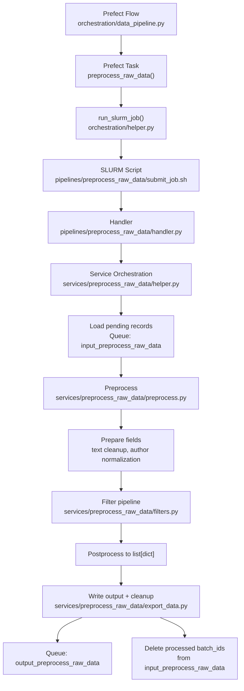

# Preprocess Raw Data Runbook

This runbook explains how the `preprocess_raw_data` service is executed in production, which files are involved, and how records move through the system.

## Purpose

The preprocessing stage takes raw post records from the input queue, normalizes and filters them, then writes surviving records to the output queue for downstream enrichment/inference services.

At a high level it does:

1. Load pending records from `input_preprocess_raw_data`.
2. Normalize fields (text cleanup, author field normalization).
3. Apply language/content/account filters.
4. Write processed records to `output_preprocess_raw_data`.
5. Delete processed batch IDs from the input queue.

## Production entrypoint and call chain

Production execution path:

1. `orchestration/data_pipeline.py`
   - Prefect flow `production_data_pipeline()`
   - Submits task `preprocess_raw_data()`
2. `orchestration/helper.py`
   - `run_slurm_job(...)` submits and waits for SLURM job completion
3. `pipelines/preprocess_raw_data/submit_job.sh`
   - Activates environment and runs `pipelines/preprocess_raw_data/handler.py`
4. `pipelines/preprocess_raw_data/handler.py`
   - Parses event/backfill args
   - Calls `preprocess_latest_raw_data(...)`
5. `services/preprocess_raw_data/helper.py`
   - Loads records from queue (`get_posts_to_preprocess(...)`)
   - Calls `preprocess_latest_posts(...)`
6. `services/preprocess_raw_data/preprocess.py`
   - Prepares DataFrame
   - Calls `filter_posts(...)`
   - Converts to list-of-dicts
   - Calls `write_posts_to_cache(...)`
7. `services/preprocess_raw_data/export_data.py`
   - Writes to output queue
   - Deletes processed batch IDs from input queue

## Record shape and transformation notes

In `prepare_posts_for_preprocessing(...)`:

- Replaces newline characters in `text` with spaces and trims whitespace.
- Renames `author` to `author_did` if needed.
- Ensures `author_handle` exists (sets `None` when absent).
- Adds `source` column (currently `None`).

In `filter_posts(...)`:

- Removes rows with null `text`.
- Adds `is_english`; keeps only English posts.
- Computes filter flags:
  - `post_is_nsfw`
  - `author_is_nsfw`
  - `is_spam`
- Sets:
  - `passed_filters` (inverse of failure flags)
  - `filtered_by_func` (first matching failed filter label)
  - `preprocessing_timestamp` / `filtered_at`
- Returns both filtered DataFrame and metadata summary counts.

Previously stubbed bot and hate-speech classifiers were removed from this pipeline; `passed_filters` and metadata only reflect English, NSFW, and spam signals above.

## Queue contract

- Input queue: `input_preprocess_raw_data`
  - Loaded with pending records.
  - Records include `batch_id` used for cleanup after processing.
- Output queue: `output_preprocess_raw_data`
  - Receives post-filter records for downstream services.

`write_posts_to_cache(...)` behavior:

- If no posts: no-op.
- If posts exist:
  - batch-add posts to output queue
  - batch-delete input queue items by successful `batch_id`s

## Mermaid diagram

## Operational checks

- If preprocessing appears "stuck":
  - Check Prefect run status for `production_data_pipeline`.
  - Check SLURM job/log output for `preprocess_raw_data` job.
  - Verify input queue has pending records.
- If output is unexpectedly low:
  - Inspect filter breakdown metadata from `filter_posts(...)`.
  - Check whether backfill args or timestamp overrides were applied.
- If output queue grows but parquet output does not:
  - Check downstream drainer script/service consuming `output_preprocess_raw_data`.
