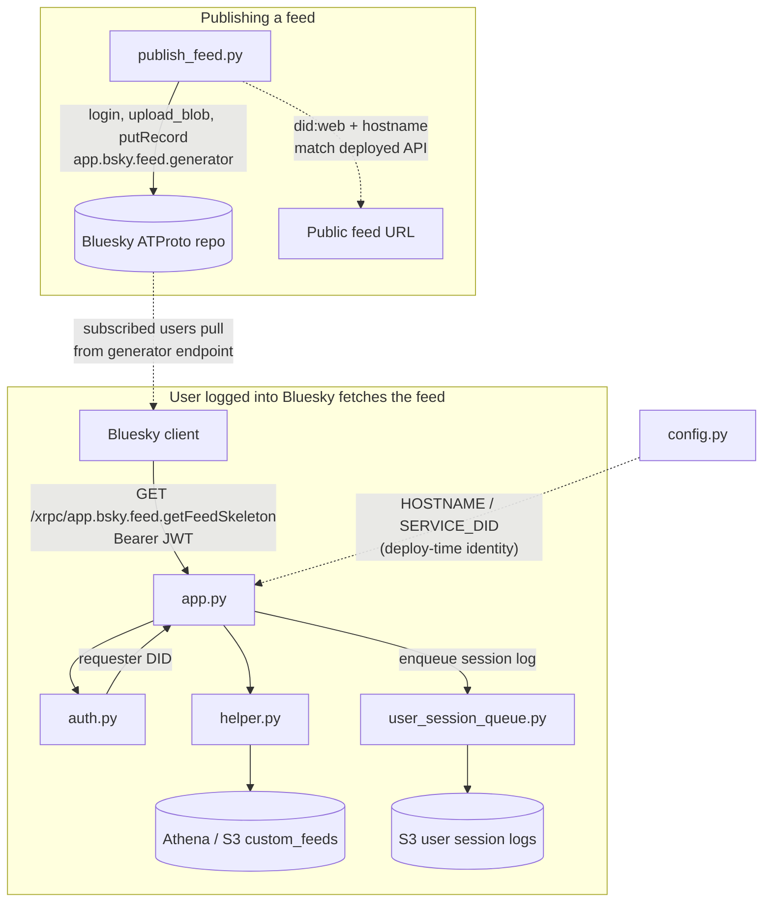

# Feed API

## Purpose

This was the feed API that hosted our feeds. The Bluesky client called our API to retrieve the personalized feed skeleton (post URIs and pagination) to show to users.

## Key Files

| File | Description |
|------|-------------|
| `app.py` | FastAPI application: Bluesky-compatible routes (`getFeedSkeleton`, `describeFeedGenerator`, DID document), in-memory feed cache refreshed from S3, request deduplication, Mangum handler for Lambda, and hooks into logging. Originally hosted on AWS lambda, but cold-start problem led to poor latency, so final version was hosted on a persistent EC2 instance |
| `auth.py` | Validates the `Authorization` JWT using ATProto’s `verify_jwt` and an in-memory DID resolver; returns the requester’s DID or raises HTTP errors. |
| `config.py` | Reads `HOSTNAME` and `SERVICE_DID` from the environment (Bluesky feed-generator template pattern); `SERVICE_DID` defaults to `did:web:{HOSTNAME}`. |
| `helper.py` | Loads study users and latest feeds via Athena/S3, builds paginated feed slices and cursors, short-lived request cache (serverless cache), and helpers to export session logs to S3. |
| `user_session_queue.py` | Background thread and queue that batches user session logs and flushes them to S3 (primary and backup keys) on a timer. |
| `publish_feed.py` | One-off script: logs into Bluesky with handle/password from env, uploads an optional avatar, and publishes the `app.bsky.feed.generator` record so the network points subscribers at this feed service. |

## How the key files relate

Two flows: registering the feed on Bluesky, and serving it when a user opens the feed in the client.

## Other Files

| File | Description |
|------|-------------|
| `delete_old_feeds.py` | Deletes legacy test feed generator records from the Bluesky repo via `com.atproto.repo.delete_record` for a fixed list of URIs. |
| `test_endpoint.py` | Manual script that calls `/get-default-feed` against the deployed host using the default test token from Secrets Manager. |
| `test_app.py` | Builds a test JWT and sends HTTP requests to exercise authenticated feed behavior. |
| `threading_test.py` | Standalone FastAPI/asyncio experiment for background refresh threading (not part of production routing). |
| `locustfile.py` | Locust load-test user that hammers `/get-default-feed` with the default test token. |
| `run_locust.sh` | Shell wrapper to run `locustfile.py` headless against the configured host with set user count, spawn rate, and duration. |
