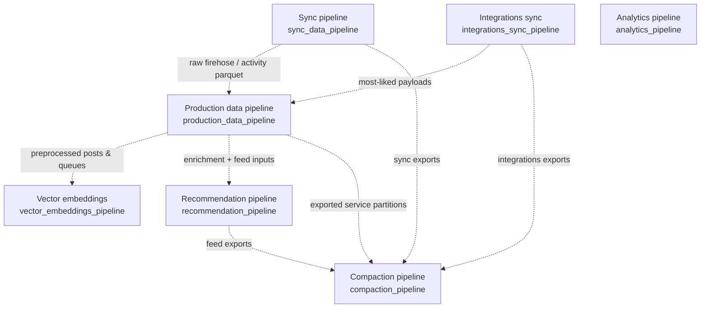
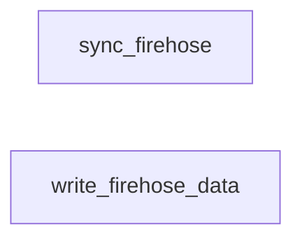
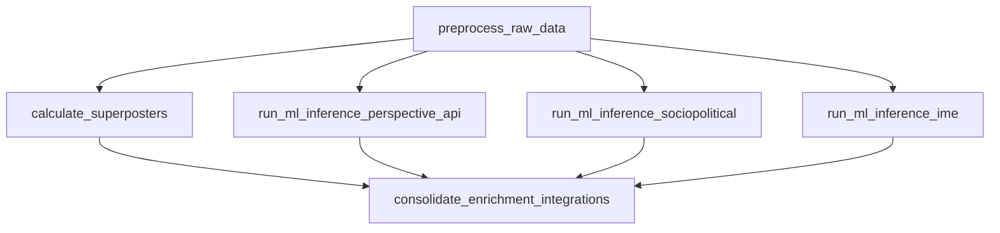
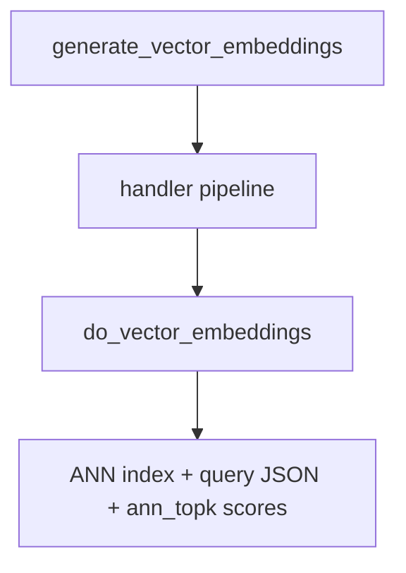
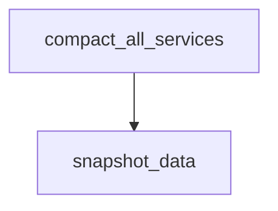
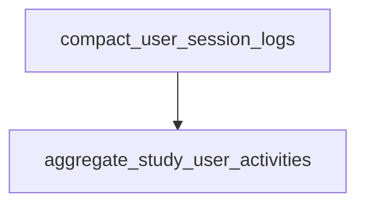

# Orchestration

Prefect flows under this directory schedule work on the Quest HPC cluster: each flow submits SLURM jobs via the bash scripts in [`pipelines/`](../pipelines/).

---

## Prefect DAGs

### End-to-end

---

### 1. Sync pipeline

Runs firehose ingest and the jetstream writer as two independent long-running SLURM tasks so streaming capture and persistence proceed in parallel.

| Prefect flow | SLURM trigger |
| --- | --- |
| [`sync_pipeline.py`](sync_pipeline.py) | [`submit_sync_pipeline_job.sh`](submit_sync_pipeline_job.sh) |

---

### 2. Integrations sync pipeline

Pulls curated Bluesky trending and most-liked feeds on a fixed interval so popular content missing from the firehose slice is ingested periodically.

| Prefect flow | SLURM trigger |
| --- | --- |
| [`integrations_sync_pipeline.py`](integrations_sync_pipeline.py) | [`submit_integrations_sync_pipeline_job.sh`](submit_integrations_sync_pipeline_job.sh) |

---

### 3. Production data pipeline

Runs preprocessing once per tick, fans out superposter detection and Perspective, sociopolitical, and IME classifiers in parallel, then merges all integration outputs in consolidation.

| Prefect flow | SLURM trigger |
| --- | --- |
| [`data_pipeline.py`](data_pipeline.py) | [`submit_data_pipeline_job.sh`](submit_data_pipeline_job.sh) |

---

### 4. Vector embeddings pipeline

Runs offline embedding generation from preprocessed material (lazy Torch/Transformers load), then FAISS ANN rebuild, query-vector export, and ANN similarity Parquet under the same `vector_embeddings/similarity_scores/` prefix as legacy exports. Workers are typically GPU-capable but may CPU-fallback unless `VECTOR_EMBEDDINGS_REQUIRE_GPU` is set. No `submit_*` orchestration shell script ships next to this flow; run [`vector_embeddings_pipeline.py`](vector_embeddings_pipeline.py) on the cluster like the other entrypoints or keep it on Prefect `serve()`.

| Prefect flow | SLURM trigger |
| --- | --- |
| [`vector_embeddings_pipeline.py`](vector_embeddings_pipeline.py) | — |

---

### 5. Recommendation pipeline

Scores and ranks candidate posts and exports personalized feeds for consumption downstream.

| Prefect flow | SLURM trigger |
| --- | --- |
| [`recommendation_pipeline.py`](recommendation_pipeline.py) | [`submit_recommendation_pipeline_job.sh`](submit_recommendation_pipeline_job.sh) |

---

### 6. Compaction pipeline

Rewrites partitioned exports for configured services, then snapshots designated trees once compaction finishes.

| Prefect flow | SLURM trigger |
| --- | --- |
| [`compaction_pipeline.py`](compaction_pipeline.py) | [`submit_compaction_pipeline_job.sh`](submit_compaction_pipeline_job.sh) |

---

### 7. Analytics pipeline

Compacts user session telemetry first, then aggregates study user activity tables used for analytics and exports.

| Prefect flow | SLURM trigger |
| --- | --- |
| [`analytics_pipeline.py`](analytics_pipeline.py) | [`submit_analytics_pipeline_job.sh`](submit_analytics_pipeline_job.sh) |

