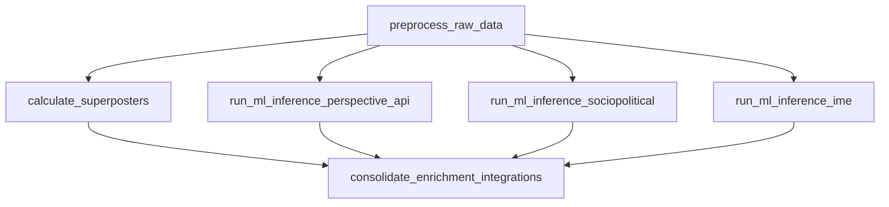
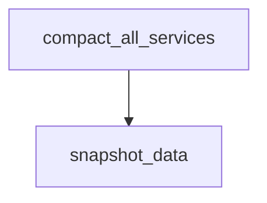
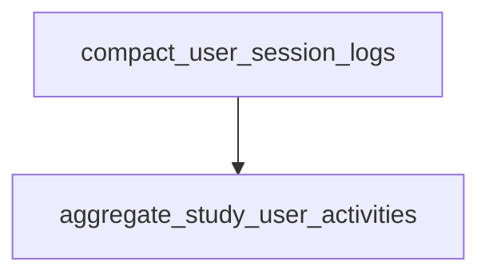

# Services

## Summary

The `services/` directory holds Python modules grouped by **domain service** (ingestion, preprocessing, ML labeling, feed generation, compaction, analytics, research utilities, and backfill). Production orchestration lives under [`orchestration/`](../orchestration/): each **Prefect flow** submits **SLURM** batch jobs that run the matching scripts under [`pipelines/`](../pipelines/). Handlers and job wrappers in `pipelines/` call into `services/` for the actual logic.

For a **compact directory-by-directory overview** (including primary entry files under `services/` and `pipelines/`), see [`SERVICES_SUMMARY.md`](SERVICES_SUMMARY.md).

## Workflows

The diagrams below mirror the **task dependency graph** inside each orchestration module (`wait_for` edges). They do **not** depict cross-pipeline dependencies between flows (for example, recommendation assumes enriched data already exists from the data pipeline). The **vector embeddings** flow is its own DAG (scheduled separately); it reads preprocessed posts but is not a parent/child of the data pipeline in Prefect.

### Sync Pipeline

Defined in [`orchestration/sync_pipeline.py`](../orchestration/sync_pipeline.py). Both tasks are submitted from the flow with **no mutual wait**, so they **run in parallel** (two roots from the same flow run).

**Services in this DAG**

| Orchestration task | Role |
| --- | --- |
| `sync_firehose` | Runs the firehose ingest job; underlying logic uses **`services/sync/stream/`** (Flask app / streaming pipeline) via `pipelines/sync_post_records/firehose/`. |
| `write_firehose_data` | Persists streamed firehose batches from cache/working storage into durable layout (`pipelines/sync_post_records/firehose/submit_firehose_writes_job.sh`). |

**Example flow**

1. Prefect runs `sync_data_pipeline()`.
2. It submits two SLURM jobs: firehose streaming/pull and a separate firehose write job.
3. Raw post records land in the stack’s sync storage for **`preprocess_raw_data`** and downstream queues.

### Integrations Sync Pipeline

Defined in [`orchestration/integrations_sync_pipeline.py`](../orchestration/integrations_sync_pipeline.py). Single-task flow (scheduled every two hours in `serve`).

**Services in this DAG**

| Orchestration task | Role |
| --- | --- |
| `sync_most_liked` | Fetches curated trending / most-liked feeds from Bluesky; logic in **`services/sync/most_liked_posts/`** via `pipelines/sync_post_records/most_liked/`. |

**Example flow**

1. Prefect triggers `integrations_sync_pipeline()`.
2. SLURM runs `pipelines/sync_post_records/most_liked/submit_job.sh`.
3. Popular-post payloads are stored for integrations that depend on off-firehose content.

### Data Pipeline

Defined in [`orchestration/data_pipeline.py`](../orchestration/data_pipeline.py) as `production_data_pipeline`. **`preprocess_raw_data`** runs first. **`calculate_superposters`**, **`run_ml_inference_perspective_api`**, **`run_ml_inference_sociopolitical`**, and **`run_ml_inference_ime`** all run **in parallel** once preprocessing finishes. **`consolidate_enrichment_integrations`** waits until **all four** of those branches complete.

**Services in this DAG**

| Orchestration task | Role |
| --- | --- |
| `preprocess_raw_data` | Dequeues raw synced posts, filters and enriches (spam/NSFW/language, etc.), enqueues work for ML integrations — **`services/preprocess_raw_data/`**. |
| `calculate_superposters` | Identifies high-volume posters for feed penalties — **`services/calculate_superposters/`**. |
| `run_ml_inference_perspective_api` | Queue-driven Perspective labeling — **`services/ml_inference/perspective_api/`** (via `pipelines/classify_records/perspective_api/`). |
| `run_ml_inference_sociopolitical` | Queue-driven sociopolitical labeling — **`services/ml_inference/sociopolitical/`** (via `pipelines/classify_records/sociopolitical/`). |
| `run_ml_inference_ime` | Queue-driven IME (Individualized Moral Equivalence) labeling — **`services/ml_inference/ime/`** (via `pipelines/classify_records/ime/`). |
| `consolidate_enrichment_integrations` | Merges preprocessed posts with integration outputs (labels, optional similarity fields) — **`services/consolidate_enrichment_integrations/`**. |

**Example flow**

1. Preprocessing completes for a partition window and fills inference input queues.
2. Superposter metrics and Perspective, sociopolitical, and IME batches run concurrently on the cluster.
3. Consolidation merges fresh labels with preprocessed posts so **recommendation** and analytics jobs read a single enriched dataset.

### Vector Embeddings Pipeline

Defined in [`orchestration/vector_embeddings_pipeline.py`](../orchestration/vector_embeddings_pipeline.py) as `vector_embeddings_pipeline`. Single-task flow that submits the GPU SLURM job under `pipelines/generate_vector_embeddings/submit_job.sh`. Prefect `serve` uses a **24-hour** interval by default (tune `num_hours_kickoff` in that module if needed).

**Services in this DAG**

| Orchestration task | Role |
| --- | --- |
| `generate_vector_embeddings` | Runs transformer-based embeddings and similarity-style scores — **`services/generate_vector_embeddings/`** via `pipelines/generate_vector_embeddings/handler.py`. |

**Example flow**

1. Prefect triggers `vector_embeddings_pipeline()` on schedule (or manually).
2. SLURM allocates GPU (`pipelines/generate_vector_embeddings/submit_job.sh`), runs `handler.py`, and writes embedding outputs for downstream enrichment or research.

### Recommendation Pipeline

Defined in [`orchestration/recommendation_pipeline.py`](../orchestration/recommendation_pipeline.py).

**Services in this DAG**

| Orchestration task | Role |
| --- | --- |
| `rank_score_feeds` | Loads enriched posts and user context, scores, ranks/reranks, exports feeds — **`services/rank_score_feeds/`** (composition root: `orchestrator.py`; SLURM via `pipelines/rank_score_feeds/`). |

**Example flow**

1. Prefect starts the recommendation flow on its schedule (every four hours in `serve`).
2. Feed generation writes updated personalized feeds for study participants using consolidated enrichment and superposter signals.

### Compaction Pipeline

Defined in [`orchestration/compaction_pipeline.py`](../orchestration/compaction_pipeline.py). **`snapshot_data`** waits on **`compact_all_services`**.

**Services in this DAG**

| Orchestration task | Role |
| --- | --- |
| `compact_all_services` | Compacts partitioned datasets across configured services — **[`local_compaction.py`](compact_all_services/local_compaction.py)**. |
| `snapshot_data` | Copies designated active trees into cache/backup locations — **`services/snapshot_data/`**. |

**Example flow**

1. Compaction reduces small files / rewrites partitions for storage efficiency.
2. Snapshot captures a consistent backup view after compaction finishes (cron-driven in `serve`).

### Analytics Pipeline

Defined in [`orchestration/analytics_pipeline.py`](../orchestration/analytics_pipeline.py). **`aggregate_study_user_activities`** waits on **`compact_user_session_logs`**.

**Services in this DAG**

| Orchestration task | Role |
| --- | --- |
| `compact_user_session_logs` | Compacts application session / interaction logs — **`services/compact_user_session_logs/`**. |
| `aggregate_study_user_activities` | Builds consolidated study activity tables (e.g. Athena-backed extracts per partition) — **`services/aggregate_study_user_activities/`**. |

**Example flow**

1. Session logs are compacted for the reporting window.
2. Activity aggregation joins participant behavior into analytics-ready tables for research exports.

## Standalone services

These folders are **not** wired into the Prefect workflows above. They are run **ad hoc**, from separate SLURM/Lambda jobs, or from notebooks and CLI scripts. Descriptions follow [`SERVICES_SUMMARY.md`](SERVICES_SUMMARY.md).

### `backfill`

Historical labeling and PDS-oriented workflows: enqueue posts missing labels, run integration runners against queues, flush cache buffers to storage, and tooling under `pds_backfills/`. Primary CLI entry: `pipelines/backfill_records_coordination/app.py`.

### `calculate_analytics`

Operational helpers such as **per-integration record counts** over date ranges (`count_records_for_integration.py`), plus **`analyses/`** and **`study_analytics/`** for study reports and one-off research notebooks.

### `consolidate_post_records`

Normalizes firehose, feed, and related record shapes into **one consolidated post schema** for downstream consumers (`helper.py`).

### `fetch_posts_used_in_feeds`

Given serialized feeds by day, resolves and persists the **underlying posts** that appeared in those feeds (`helper.py`).

### `get_author_to_average_toxicity_outrage`

Aggregates Perspective-style **toxicity and outrage** to **per-author averages** for a partition date (`helper.py`).

### `get_pipeline_analytics`

Placeholder / intent-only docs for **pipeline telemetry** (for example daily counts per data repo); see `get_pipeline_analytics/README.md`.

### `get_posts_liked_by_study_users`

Matches study users’ **likes** (from PDS backfill outputs) to stored posts over a lookback window and writes aligned datasets (`helper.py`).

### `get_preprocessed_posts_used_in_feeds`

Joins **posts used in feeds** with **`preprocessed_posts`** so analyses target content that actually surfaced in feeds (`helper.py`).

### Additional `ml_inference` integrations

Core queue and batching patterns live in **`services/ml_inference/helper.py`**. The **production data DAG** wires **Perspective**, **sociopolitical**, and **IME**. **Valence** and **intergroup** (and other experiments) are invoked via **`pipelines/classify_records/<integration>/`** or backfill flows, not through `production_data_pipeline`.

### `participant_data`

Study **participant profiles** in DynamoDB (`study_participants`): insert/update/delete/list helpers used across pipelines and tooling (`helper.py`).

### `repartition_service`

**Safe migration** of on-disk partition layouts with backups, staging, and verification (`helper.py`).

### Bluesky Jetstream CLI (`sync/jetstream`)

Alternative firehose path via **Jetstream** (`jetstream_cli.py`, `helper.py`). Not referenced by `sync_pipeline.py`; run manually when needed.

### Bluesky search helpers (`sync/search`)

Pagination and search utilities for Bluesky API usage; not part of the Prefect sync DAG.

### `write_cache_buffers_to_db`

Drains **cache / queue buffers** into persistent local/tabular exports; overlaps conceptually with **`services/backfill/`** writers for integration output flush (`helper.py`).

## Deprecated

Do **not** build new features here.

| Location | Notes |
| --- | --- |
| **`compact_dedupe_data/`** | Legacy compaction/dedupe with DynamoDB session tracking. Pipeline handler under `pipelines/deprecated/compact_dedupe_data/`. |
| **`deprecated/`** | Archived scripts (old feeds, engagement updates, SQS consumers, training-data generators, etc.). |
