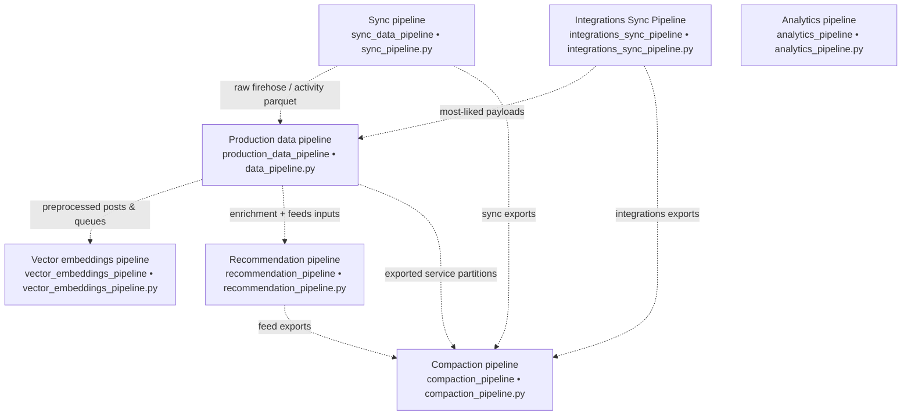
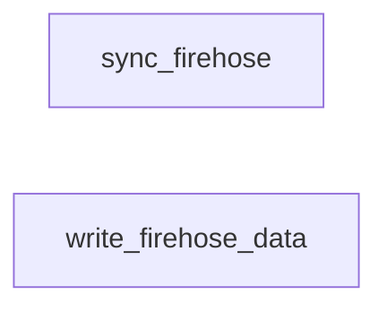
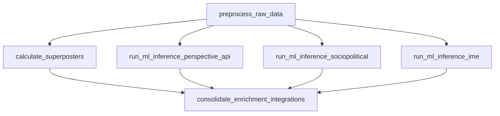
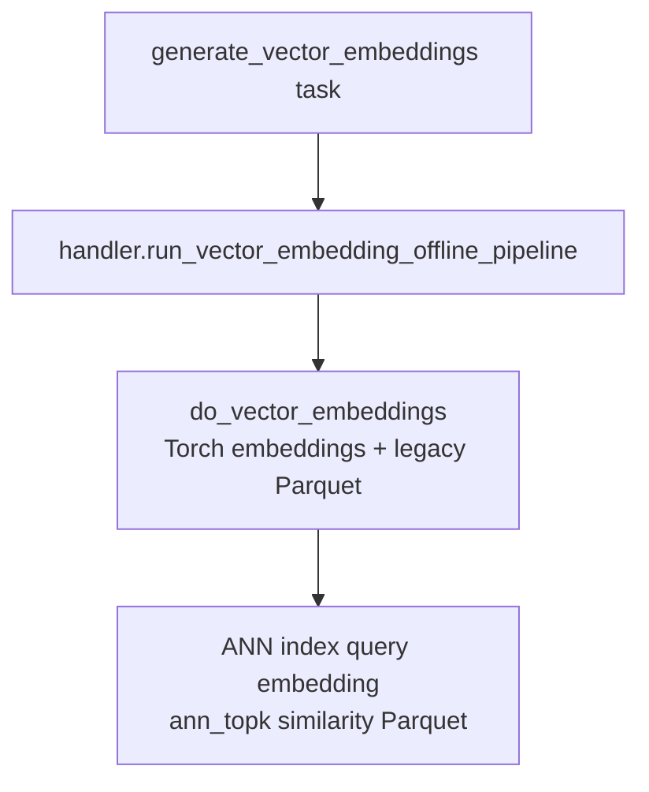
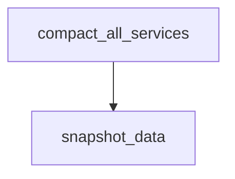
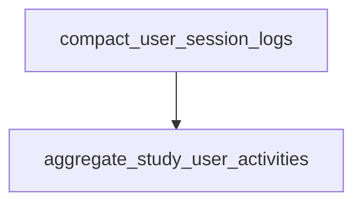

# Services

This directory holds Python modules grouped by service: cohesive chunks of ingestion, preprocessing, enrichment, feed generation, storage maintenance, analytics, research helpers, and backfill tooling.

Every folder here is categorized in one of three ways:

| Category | What belongs here |
| --- | --- |
| Production pipeline | Modules reached from Prefect flows under [`orchestration/`](../orchestration/). SLURM jobs in [`pipelines/`](../pipelines/) call handlers that import these services. |
| Analysis | Study reports, one-off research code, operational counts, and standalone helpers whose Python imports live only under `calculate_analytics/` (plus the helpers listed in the analysis table). |
| Everything else | Ad hoc tooling, historical/backfill pipelines, shared helpers also used outside analytics, etc. |

---

## Production pipeline

Orchestration source is under [`orchestration/`](../orchestration/).

### End-to-end: how the Prefect flows relate

---

### 1. Sync pipeline

| Prefect task | Purpose | Primary `services/` code | README |
| --- | --- | --- | --- |
| `sync_firehose` | Starts the firehose ingest SLURM job (`pipelines/sync_post_records/firehose/submit_job.sh`). | [`sync/stream/`](sync/stream/README.md). | [`sync/stream/README.md`](sync/stream/README.md) |
| `write_firehose_data` | Persists streamed firehose batches (`submit_firehose_writes_job.sh`). | [`sync/jetstream/`](sync/README.md); writer shim lives next to ingest under `pipelines/sync_post_records/firehose/`. | [`sync/README.md`](sync/README.md) *(covers `jetstream/`; no package README)* |

---

### 2. Integrations sync pipeline

| Prefect task | Purpose | Primary `services/` code | README |
| --- | --- | --- | --- |
| `sync_most_liked` | SLURM job syncing curated Bluesky trending/most-liked feeds (`pipelines/sync_post_records/most_liked/`). | [`sync/most_liked_posts/helper.py`](sync/README.md) (see `most_liked_posts/` row in [`sync/README.md`](sync/README.md)). | [`sync/README.md`](sync/README.md) |

---

### 3. Production data pipeline

| Prefect task | Purpose | Primary `services/` package | README |
| --- | --- | --- | --- |
| `preprocess_raw_data` | Dequeues raw synced records; spam/NSFW/language gates; emits ML/integration queue work. | [`preprocess_raw_data/`](preprocess_raw_data/README.md). | [`preprocess_raw_data/README.md`](preprocess_raw_data/README.md) |
| `calculate_superposters` | Daily high-volume poster lists for downstream ranking penalties. | [`calculate_superposters/`](calculate_superposters/README.md). | [`calculate_superposters/README.md`](calculate_superposters/README.md) |
| `run_ml_inference_perspective_api` | Queue-driven Perspective toxicity/harassment-style labeling (`pipelines/classify_records/perspective_api/`). | [`ml_inference/perspective_api/`](ml_inference/perspective_api/README.md). | [`ml_inference/perspective_api/README.md`](ml_inference/perspective_api/README.md) |
| `run_ml_inference_sociopolitical` | Queue-driven sociopolitical classifier (`pipelines/classify_records/sociopolitical/`). | [`ml_inference/sociopolitical/`](ml_inference/sociopolitical/README.md). | [`ml_inference/sociopolitical/README.md`](ml_inference/sociopolitical/README.md) |
| `run_ml_inference_ime` | Queue-driven IME labeling (`pipelines/classify_records/ime/`). | [`ml_inference/ime/`](ml_inference/ime/README.md). | [`ml_inference/ime/README.md`](ml_inference/ime/README.md) |
| `consolidate_enrichment_integrations` | Merges preprocessor output with classifier payloads into enriched post records feeds consume. | [`consolidate_enrichment_integrations/`](consolidate_enrichment_integrations/README.md). | [`consolidate_enrichment_integrations/README.md`](consolidate_enrichment_integrations/README.md) |

---

### 4. Vector embeddings pipeline

| Prefect task | Purpose | Primary `services/` package | README |
| --- | --- | --- | --- |
| `generate_vector_embeddings` | Offline batch: lazy Torch embeddings from preprocessed posts; versioned + legacy S3 Parquet; DynamoDB `vector_embedding_sessions`; FAISS corpus index; query-vector JSON; ANN materialized similarity rows ([`pipelines/generate_vector_embeddings/`](../pipelines/generate_vector_embeddings/) → `services.generate_vector_embeddings.helper`). | [`generate_vector_embeddings/`](generate_vector_embeddings/README.md) | [`generate_vector_embeddings/README.md`](generate_vector_embeddings/README.md), [pipeline README](../pipelines/generate_vector_embeddings/README.md) |

---

### 5. Recommendation pipeline

| Prefect task | Purpose | Primary `services/` package | README |
| --- | --- | --- | --- |
| `rank_score_feeds` | Loads enrichment + context; ranks/reranks; exports personalized feeds (`pipelines/rank_score_feeds/`). | [`rank_score_feeds/`](rank_score_feeds/README.md). | [`rank_score_feeds/README.md`](rank_score_feeds/README.md) |

---

### 6. Compaction pipeline

| Prefect task | Purpose | Primary `services/` package | README |
| --- | --- | --- | --- |
| `compact_all_services` | Compacts partitioned local datasets per configured service exports (`pipelines/compact_all_services/handler.py` → compaction helpers including [`local_compaction`](compact_all_services/local_compaction.py)). | [`compact_all_services/`](compact_all_services/README.md). | [`compact_all_services/README.md`](compact_all_services/README.md) |
| `snapshot_data` | After compaction succeeds, clones designated trees into snapshot/cache paths (`pipelines/snapshot_data/`). | [`snapshot_data/`](snapshot_data/README.md). | [`snapshot_data/README.md`](snapshot_data/README.md) |

---

### 7. Analytics pipeline

| Prefect task | Purpose | Primary `services/` package | README |
| --- | --- | --- | --- |
| `compact_user_session_logs` | Compacts partitioned user session / telemetry logs emitted by the client stack (`pipelines/compact_user_session_logs/`). | [`compact_user_session_logs/`](compact_user_session_logs/README.md). | [`compact_user_session_logs/README.md`](compact_user_session_logs/README.md) |
| `aggregate_study_user_activities` | Aggregates consolidated study behavioral tables referenced by Athena exports (`pipelines/aggregate_study_user_activities/` → `services.aggregate_study_user_activities`). | [`aggregate_study_user_activities/`](aggregate_study_user_activities/) *(no README)* | [Orchestration docs §6 — Analytics Pipeline](../orchestration/README.md#6-analytics-pipeline) |

## Analysis

Code used for research exports, exploratory analyses, visualization, operational counts over integrations, and helpers only imported by that tree (`calculate_analytics/` plus `get_*` / `fetch_*` services).

### Analysis workspace

| Service | Purpose | README |
| --- | --- | --- |
| [`calculate_analytics/`](calculate_analytics/README.md) | Top-level umbrella: operational scripts (e.g. integration record counts over date windows), dated analyses under `analyses/`, study reporting under `study_analytics/`, and shared loaders under `shared/`. | [README](calculate_analytics/README.md) |
| [`fetch_posts_used_in_feeds/`](fetch_posts_used_in_feeds/README.md) | Given serialized feeds by day, resolves and persists underlying posts—the dataset later joined for “what appeared in-network” analytic slices. Runs as standalone jobs and is consumed from study/analytics loaders. | [README](fetch_posts_used_in_feeds/README.md) |
| [`get_author_to_average_toxicity_outrage/`](get_author_to_average_toxicity_outrage/README.md) | Aggregates Perspective-style toxicity/outrage signals to per-author averages for analytic exports. | [README](get_author_to_average_toxicity_outrage/README.md) |
| [`get_posts_liked_by_study_users/`](get_posts_liked_by_study_users/README.md) | Aligns study users’ likes (from backfill-aligned inputs) to stored posts across a configurable lookback. | [README](get_posts_liked_by_study_users/README.md) |
| [`get_preprocessed_posts_used_in_feeds/`](get_preprocessed_posts_used_in_feeds/README.md) | Joins in-feed URIs to `preprocessed_posts` rows so analytic queries target content that surfaced in feeds. | [README](get_preprocessed_posts_used_in_feeds/README.md) |

Nested analysis READMEs (`calculate_analytics/analyses/*/README.md`, `calculate_analytics/study_analytics/*/README.md`, etc.) document individual studies; see the root `calculate_analytics` README as the directory map.

## Everything else

Ad hoc workloads, tooling shared beyond analytics, integrations off the scheduled data DAG, and ingestion utilities not wired into Prefect’s sync/data/recommend flows.

### Other services

| Service | Purpose | README |
| --- | --- | --- |
| [`backfill/`](backfill/README.md) | Historical labeling runs, coordination with integration queues/cache flush helpers, PDS-facing backfill tooling. | [README](backfill/README.md) |
| [`consolidate_post_records/`](consolidate_post_records/README.md) | Canonical consolidation of Firehose/`FeedViewPost`/`Record` shapes consumed by `sync/` and `preprocess_raw_data` (schemas + helpers)—not confined to analytics. | [README](consolidate_post_records/README.md) |
| [`participant_data/`](participant_data/README.md) | DynamoDB accessors for participant metadata used by tooling and pipelines (study enrollment lists, etc.). | [README](participant_data/README.md) |
| [`repartition_service/`](repartition_service/README.md) | Safely rewires partition directory layouts with backup/staging workflows. | [README](repartition_service/README.md) |
| [`write_cache_buffers_to_db/`](write_cache_buffers_to_db/README.md) | Drains cache/queue buffers to durable parquet-style exports overlapping backfill/cache writers. | [README](write_cache_buffers_to_db/README.md) |
| [`ml_inference/`](ml_inference/README.md) | Shared inference drivers (queues, batches, adapters). Covers patterns reused across integrations scheduled on and off `production_data_pipeline`. | [README](ml_inference/README.md) |
| [`ml_inference/valence_classifier/`](ml_inference/valence_classifier/README.md) | Valence labeling runnable via classify/backfill pipelines, not a node on the scheduled enrichment DAG alongside Perspective/IME. | [README](ml_inference/valence_classifier/README.md) |
| [`ml_inference/intergroup/`](ml_inference/intergroup/README.md) | Intergroup labeling service and notebooks/experiments; invoked through dedicated pipelines or research jobs. | [README](ml_inference/intergroup/README.md) |
| [`sync/search/`](sync/README.md) | Search-API crawl helpers retained for troubleshooting and small batches—not the production firehose ingest path. | Doc: [`sync/README.md`](sync/README.md) *(see “search helpers” bullet)* |
