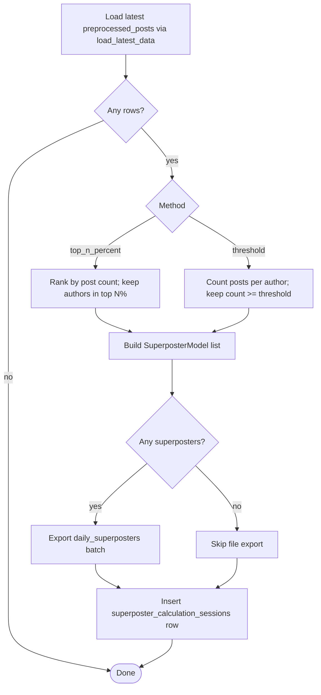

# Calculate superposters

This service finds authors who post at unusually high volume over a short lookback window so downstream ranking (for example personalized feeds) can treat them as **superposters** and apply penalties or caps. It reads the latest **`preprocessed_posts`** slice, groups by `author_did`, and keeps authors matching either a **minimum post-count threshold** (what `pipelines/calculate_superposters/handler.py` uses in production) or an optional **top-N-percent** cutoff. Non-empty results are written as a **`daily_superposters`** dataset batch and summarized in DynamoDB (`superposter_calculation_sessions`); other code loads the latest DID set via `load_data.load_latest_superposters()` when blending those signals into scoring.

This runs inside the production data pipeline Prefect flow in [`orchestration/data_pipeline.py`](../../orchestration/data_pipeline.py). The Prefect task `calculate_superposters` submits `pipelines/calculate_superposters/submit_job.sh` on SLURM; that runs `pipelines/calculate_superposters/handler.py`, which calls `calculate_latest_superposters()` in `helper.py`.

## Service logic

