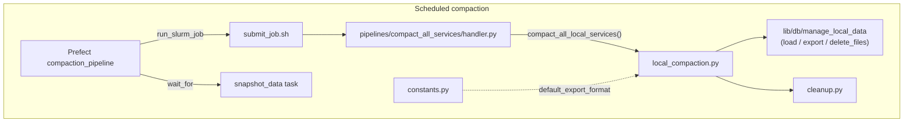
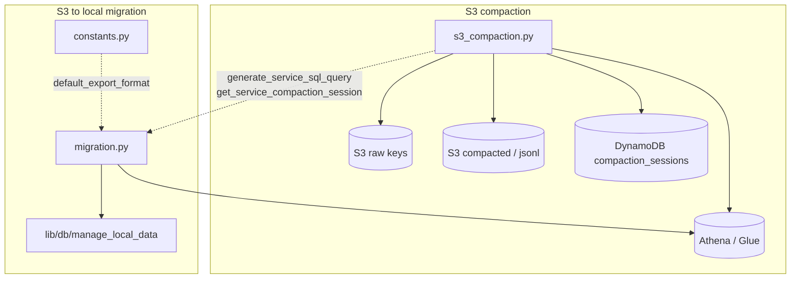

# Compaction

## Purpose

Rewrites local partitioned study datasets (via `export_data_to_local_storage`) so files stay consolidated and old shards are pruned.

## Key Files

| File | Description |
|------|-------------|
| `local_compaction.py` | For each service in `LOCAL_COMPACTION_SERVICE_NAMES`, loads from local storage, re-exports (with special cases for `preprocessed_posts`, ML inference splits by `source`, and `study_user_activity` by `record_type`), deletes prior filenames, then removes empty dirs via `cleanup`. |
| `cleanup.py` | Walks local prefixes and removes empty directories after compaction; reused by [`scripts/delete_files_from_lookback_period.py`](../../scripts/delete_files_from_lookback_period.py). |
| `s3_compaction.py` | Builds Glue/Athena SQL (dedupe when metadata says so), lists S3 keys, queries Athena, writes compacted JSONL under `compacted/`, deletes non-compacted keys, records a DynamoDB `compaction_sessions` row. Not invoked by the scheduled pipeline handler. |
| `migration.py` | Backfill: runs the same Athena query shape as S3 compaction, then writes into local active/cache layout via `export_data_to_local_storage`. |
| `constants.py` | Shared `default_export_format` so local/migration code does not import AWS clients at module import time. |

## How the key files relate

There are two separate tracks: **scheduled local compaction** (SLURM + Prefect, twice daily) and **optional AWS-backed** work (manual S3 compaction or S3→local migration).

### Scheduled local compaction

This is triggered from the compaction Prefect flow in [`orchestration/compaction_pipeline.py`](../../orchestration/compaction_pipeline.py).



### Manual AWS-backed flows

Operators or one-off scripts use `s3_compaction.py` and/or `migration.py`; these do not run in the scheduled compaction job.



## Other Files

| File / location | Description |
|-----------------|-------------|
| [`pipelines/compact_all_services/handler.py`](../../pipelines/compact_all_services/handler.py) | Lambda-style entry: calls `compact_all_local_services()`; used by `submit_job.sh` on Quest. |
| [`pipelines/compact_all_services/submit_job.sh`](../../pipelines/compact_all_services/submit_job.sh) | SLURM batch script (partition, memory, log path, conda `PYTHONPATH`). |

## Related

- [`pipelines/compact_user_session_logs/`](../../pipelines/compact_user_session_logs/) — separate session-log compaction on another schedule (analytics pipeline).

## Tests

```bash
uv run pytest services/compact_all_services/tests -v --import-mode=importlib
```

## Operators

For **failure modes and recovery** on the scheduled compaction job, see [`docs/runbooks/services/compact_all_services.md`](../../docs/runbooks/services/compact_all_services.md).
