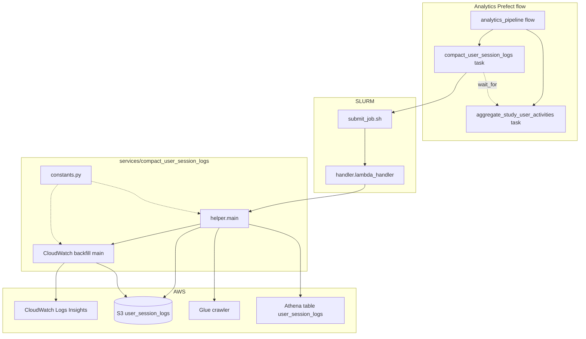

# Compact user session logs

## Purpose

Consolidates **user session logs** that the feed API writes to S3 into **roughly one compacted JSONL object per partition day** (`partition_date=YYYY-MM-DD/`), and optionally **backfills** rows from **CloudWatch Logs Insights** when study participants appeared in feed API logs but were missing from the session log pipeline. Upstream writers live in [`feed_api/`](../../feed_api/README.md) (session export / queue to S3). Downstream, the analytics Prefect flow runs **`aggregate_study_user_activities`** only after this job completes (see [`orchestration/analytics_pipeline.py`](../../orchestration/analytics_pipeline.py)).

## Key Files

| File | Description |
|------|-------------|
| `constants.py` | S3 prefix, Glue crawler name, Athena query text, dedupe column list, CloudWatch log group/stream + Insights query template, backfill defaults and filename patterns. |
| `helper.py` | Orchestration: runs CloudWatch backfill, lists S3 partitions under `user_session_logs/`, loads all rows via Athena (`SELECT * FROM user_session_logs`), dedupes each multi-file day, writes `compacted_*.jsonl`, deletes source keys, starts Glue crawler before/after query. |
| `get_missing_user_session_logs_cloudwatch.py` | Runs a CloudWatch Logs Insights query, filters to study DIDs, writes per-day `backfill_*.jsonl` under `user_session_logs/partition_date=.../`. |

## How the key files relate

Two paths: scheduled compaction (Prefect -> SLURM -> handler -> `helper.main`) and CloudWatch backfill (same `main`, first step).

### Scheduled compaction and backfill

Triggered from the analytics Prefect flow in [`orchestration/analytics_pipeline.py`](../../orchestration/analytics_pipeline.py).



## Other Files

| File / location | Description |
|-----------------|-------------|
| [`pipelines/compact_user_session_logs/handler.py`](../../pipelines/compact_user_session_logs/handler.py) | Entry point run on Quest: wraps `helper.main` in `lambda_handler` (JSON response on success). |
| [`pipelines/compact_user_session_logs/submit_job.sh`](../../pipelines/compact_user_session_logs/submit_job.sh) | SLURM direct: account, partition, memory, log path, conda env, runs `handler.py`. |
| [`pipelines/compact_user_session_logs/create_cron_job.sh`](../../pipelines/compact_user_session_logs/create_cron_job.sh) | Optional cron setup helper for this pipeline (if used in your environment). |

## Related

- [`services/compact_all_services/`](../../services/compact_all_services/README.md) — **different** job: compacts **local** study datasets and optional S3 Athena compaction; not the same as user session logs.
- [`services/aggregate_study_user_activities/`](../../services/aggregate_study_user_activities/) — runs after session log compaction in the analytics flow.
- [`feed_api/`](../../feed_api/README.md) — produces user session batches written to S3.

## Tests

```bash
uv run pytest services/compact_user_session_logs/tests -v --import-mode=importlib
```

Uses the repo root as `PYTHONPATH` (CI sets `PYTHONPATH` to the workspace).

## Operational note

Deployment tuning (log group, EC2 log stream, crawler name, S3 prefix, and related literals) lives in `constants.py` — update it when the feed host or logging layout changes. For **failure modes and recovery**, see [`docs/runbooks/services/compact_user_session_logs.md`](../../docs/runbooks/services/compact_user_session_logs.md).
