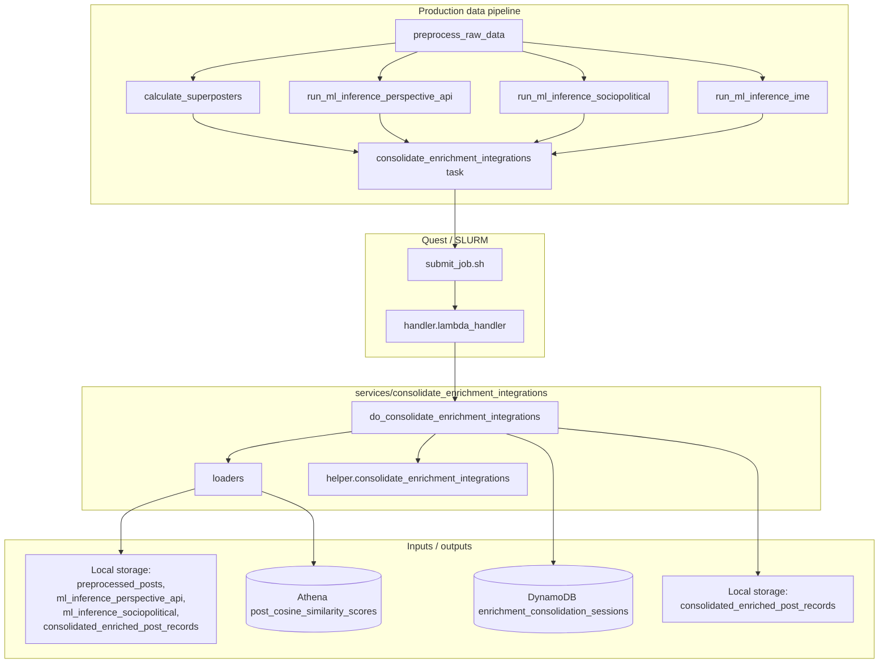

# Consolidate enrichment integrations

## Purpose

Unifies results from the latest integration runs into a single downstream representation. The data pipeline DAG waits for preprocessing and parallel enrichment jobs before running this step (see [`orchestration/data_pipeline.py`](../../orchestration/data_pipeline.py)).

## Key Files

| File | Description |
|------|-------------|
| `helper.py` | Loads latest inputs (including optional `backfill_period` / `backfill_duration`), merges enrichment fields by `uri`, filters out URIs already in `consolidated_enriched_post_records`, partitions export by `consolidation_timestamp`, appends DynamoDB sessions. |
| `loaders.py` | Loads preprocessed posts and ML inference frames from `lib.db.manage_local_data`, similarity rows from Athena, converts DataFrames to Pydantic models. |
| `models.py` | `ConsolidatedEnrichedPostModel` schema (firehose vs most_liked `source`, all merged label/similarity fields). |
| `load_data.py` | Thin `load_enriched_posts()` helper for `rank_score_feeds` and tests. |

## How the key files relate

Triggered from the Production data pipeline Prefect flow in [`orchestration/data_pipeline.py`](../../orchestration/data_pipeline.py) after preprocessing and after parallel `calculate_superposters`, `run_ml_inference_perspective_api`, `run_ml_inference_sociopolitical`, and `run_ml_inference_ime` tasks complete.



## Other Files

| File / location | Description |
|-----------------|-------------|
| [`pipelines/consolidate_enrichment_integrations/handler.py`](../../pipelines/consolidate_enrichment_integrations/handler.py) | `lambda_handler`: parses optional `backfill_period` (`"days"` \| `"hours"`) and `backfill_duration`, invokes `do_consolidate_enrichment_integrations`; runnable as `__main__`. Also used by the AWS Lambda image (Terraform). |
| [`pipelines/consolidate_enrichment_integrations/submit_job.sh`](../../pipelines/consolidate_enrichment_integrations/submit_job.sh) | SLURM submission (partition, logs, conda env, `handler.py`). |
| [`Dockerfiles/consolidate_enrichment_integrations.Dockerfile`](../../Dockerfiles/consolidate_enrichment_integrations.Dockerfile) | Container build for `consolidate_enrichment_integrations_lambda`. |

## Related

- [`services/rank_score_feeds/`](../../services/rank_score_feeds/README.md) — loads consolidated enriched posts for feed ranking.

## Tests

```bash
uv run pytest services/consolidate_enrichment_integrations/tests -v --import-mode=importlib
```

## Operators

For failure modes and recovery, see [`docs/runbooks/services/consolidate_enrichment_integrations.md`](../../docs/runbooks/services/consolidate_enrichment_integrations.md).
