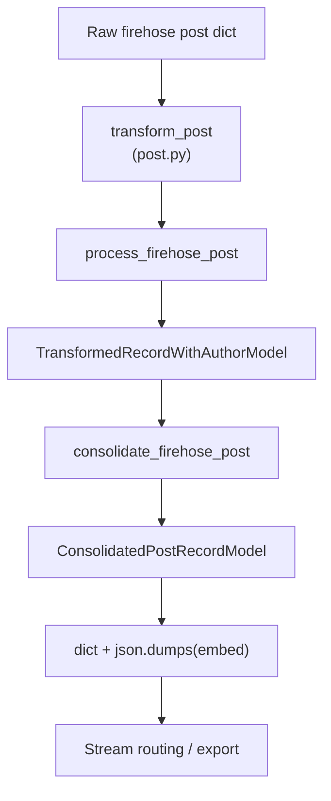
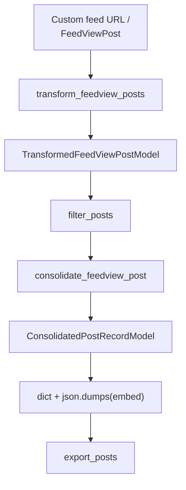
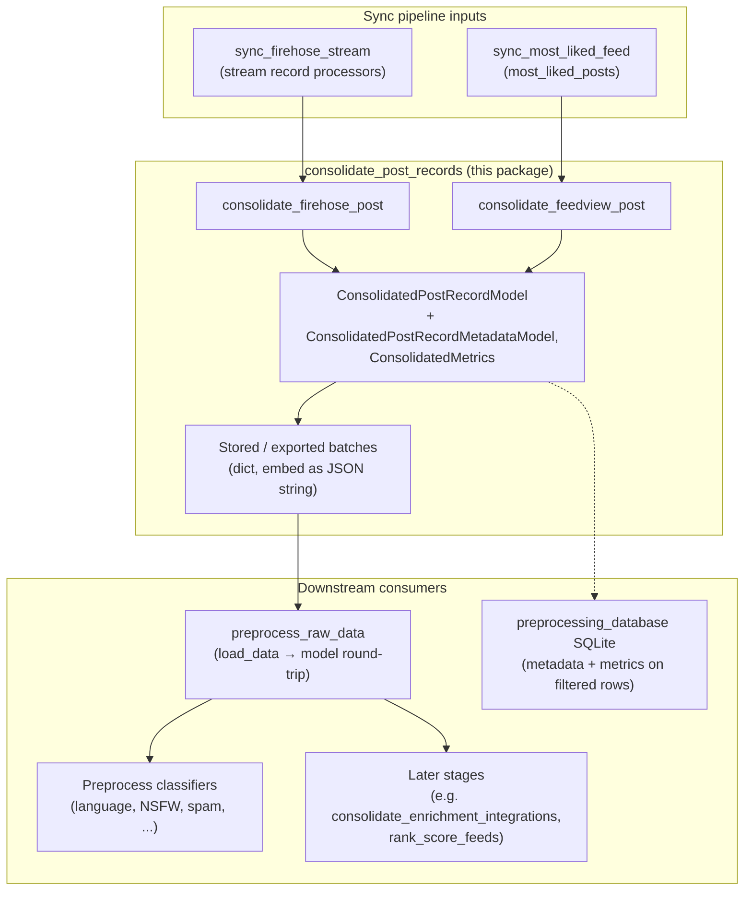

# Consolidate post records

## Purpose

The posts from the firehose have a different format than the posts that come from the feeds (specifically, the posts that come from the feeds have more information given that they have to be fully hydrated with the info needed to display the post on the frontend).

We consolidate those two formats in this service and create a "ConsolidatedPostRecord" object.

## Key Files

| File | Description |
|------|-------------|
| `helper.py` | `consolidate_firehose_post` / `consolidate_feedview_post` map Bluesky-specific intermediate models into `ConsolidatedPostRecordModel`; `consolidate_post_record` / `consolidate_post_records` dispatch by type. Firehose rows set `source="firehose"` and leave engagement metrics and sparse author fields empty where unknown; feed rows set `source="most_liked"` and copy hydrated author + counts. |
| `models.py` | `ConsolidatedPostRecordModel` (canonical post schema), `ConsolidatedPostRecordMetadataModel`, and `ConsolidatedMetrics`. Used downstream for preprocessing, SQLite filtered-post metadata, and classifiers. |

## How the key files relate

This package is a library, not a standalone job: ingest paths import it so every consumer can assume one post shape.

### Firehose path

### Feed / “most liked” path

### End-to-end

Unified view: the two sync jobs feed this library, which exposes a single post contract to preprocessing and later pipeline stages.

