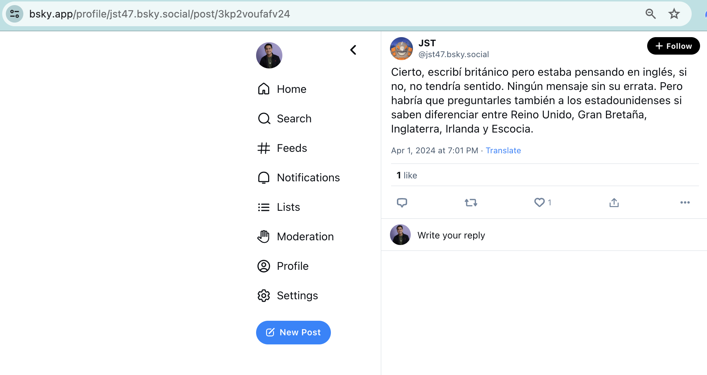
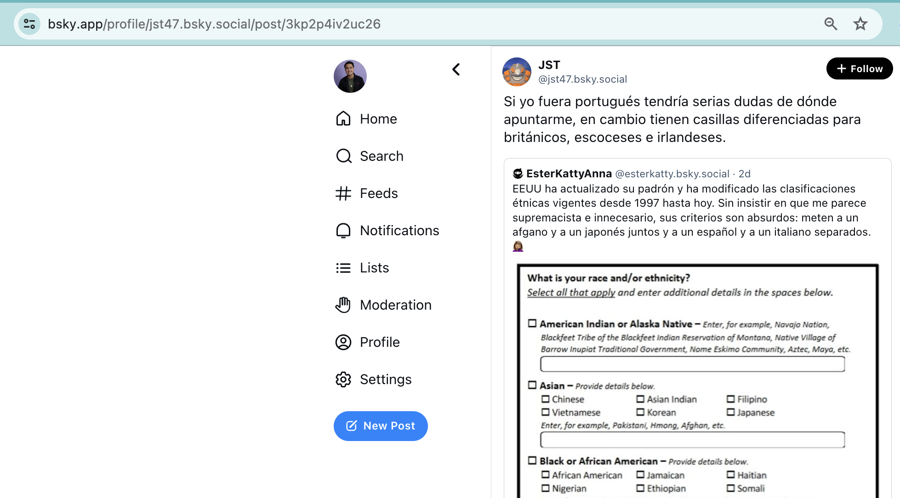
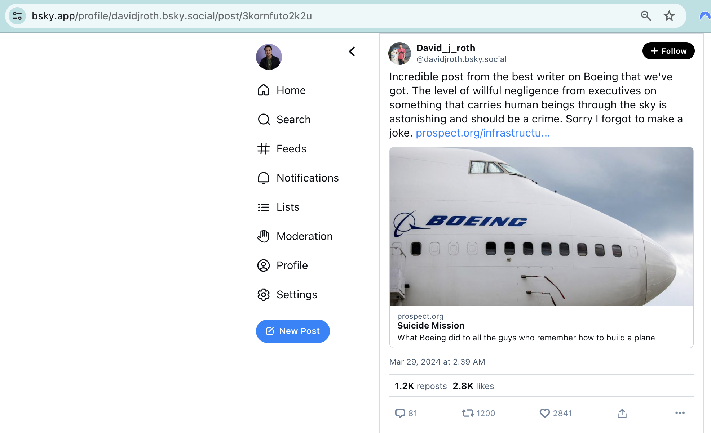

# Process message thread

We take a look at the thread that a post is a part of (if any) and add that as context to a given post. For example, is a post a comment that is responding to another post?

Some terminology clarification:
- When we look at a raw post from our database (after syncing the post from the firehose), we can see something like the following:
```python
{
    'id': 3,
    'uri': 'at://did:plc:ubvuetpkv6gmbk7tl2iphaun/app.bsky.feed.post/3kp2voufafv24',
    'created_at': '2024-04-01T11:01:34.138Z',
    'text': 'Cierto, escribí británico pero estaba pensando en inglés, si no, no tendría sentido. Ningún mensaje sin su errata. Pero habría que preguntarles también a los estadounidenses si saben diferenciar entre Reino Unido, Gran Bretaña, Inglaterra, Irlanda y Escocia.',
    'langs': 'es',
    'entities': None,
    'facets': None,
    'labels': None,
    'reply': None,
    'reply_parent': 'at://did:plc:5li5auomdflpr5h762oumqy6/app.bsky.feed.post/3kp2swbk6ll2g',
    'reply_root': 'at://did:plc:ubvuetpkv6gmbk7tl2iphaun/app.bsky.feed.post/3kp2p4iv2uc26',
    'tags': None,
    'py_type': 'app.bsky.feed.post',
    'cid': 'bafyreigx5qhvvm57hovyo2ivv7j5tz5m3sx65dlcpnt6rv5qnkk42622ha',
    'author': 'did:plc:ubvuetpkv6gmbk7tl2iphaun',
    'indexed_at': datetime.datetime(2024, 4, 1, 11, 1, 34, 481523)
}
```
- The `reply_parent` and `reply_root` are relevant for us:
    - `reply_parent` refers to the post that a post directly replies to (if any).
    - `reply_root` refers to the first post in a thread that a post is a part of (if any).

Here is a picture of the example post:


Note that the last part of the link ("3kp2voufafv24") corresponds to the last part of the `uri` field.

That post is a direct reply to this post:


Note that the last part of the parent post ("3kp2swbk6ll2g") corresponds to the last part of the uri in the "reply_parent" field.

These posts are a part of a thread started by this post:


Note that the last part of the root post ("3kp2p4iv2uc26") corresponds to the last part of the uri in the "reply_root" field.

In this same root post, we can also see that it references/links to another post (by user EsterKattyAnna).

This reference to that post is "embedded" in the original post, and is considered an "embed" to that post.

The post record corresponding to the root post is:
```python
{
    'created_at': '2024-04-01T09:03:55.674Z',
    'text': 'Si yo fuera portugués tendría serias dudas de dónde apuntarme, en cambio tienen casillas diferenciadas para británicos, escoceses e irlandeses.',
    'embed': Main(record=Main(cid='bafyreianc5p55dxtaysu2qv2z3aqal4ma5nntkk7erald6axvevfkbz4g4', uri='at://did:plc:77ug4j5ul7ce64gl6ogpe4o3/app.bsky.feed.post/3koyeyk4fdy2h', py_type='com.atproto.repo.strongRef'), py_type='app.bsky.embed.record'),
    'entities': None,
    'facets': None,
    'labels': None,
    'langs': ['es'],
    'reply': None,
    'tags': None,
    'py_type': 'app.bsky.feed.post'
}
```

Within the `embed` field is this record:
```python
{
    'cid': 'bafyreianc5p55dxtaysu2qv2z3aqal4ma5nntkk7erald6axvevfkbz4g4',
    'uri': 'at://did:plc:77ug4j5ul7ce64gl6ogpe4o3/app.bsky.feed.post/3koyeyk4fdy2h',
    'py_type': 'com.atproto.repo.strongRef'
}
```
A [strongRef](https://github.com/bluesky-social/atproto/blob/main/lexicons/com/atproto/repo/strongRef.json#L4) is just a `uri` with a `cid` field that is a hash of the post content. So, this record refers to the post that is embedded within the root post.

As defined in the [documentation](https://github.com/MarshalX/atproto/tree/main/packages/atproto_client/models/app/bsky/embed), there are actually 3 types of embeds:
- strongRef (see above)
- Images
- External content

You can also have image embeds, such as this post:


That post has the following record value:
```python
{
    'created_at': '2024-04-01T20:09:20.096Z',
    'text': 'A terminology proposal:',
    'embed': Main(images=[Image(alt='Disgusted face/interest face meme with the following scenario:\n\ndisgusted face: ARTIFICIAL INTELLIGENCE (AI)\n\ninterested face: PLAGIARIZED INFORMATION SYNTHESIS SYSTEM (PISS)', image=BlobRef(mime_type='image/jpeg', size=252203, ref=IpldLink(link='bafkreiexhf5s7lbnwpqrp5cslfef3x547ssyztymt3oave6dly2wjahtae'), py_type='blob'), aspect_ratio=AspectRatio(height=500, width=678, py_type='app.bsky.embed.images#aspectRatio'), py_type='app.bsky.embed.images#image')], py_type='app.bsky.embed.images'),
    'entities': None,
    'facets': None,
    'labels': None,
    'langs': ['en'],
    'reply': None,
    'tags': None,
    'py_type': 'app.bsky.feed.post'
 }
```

You can also have external embeds, which refer to a link plus the preview card for that link. Here is an example of that:


That post has the following record value:
```python
{
    'created_at': '2024-03-28T18:39:24.926Z',
    'text': "Incredible post from the best writer on Boeing that we've got. The level of willful negligence from executives on something that carries human beings through the sky is astonishing and should be a crime. Sorry I forgot to make a joke. prospect.org/infrastructu...",
    'embed': Main(external=External(description='What Boeing did to all the guys who remember how to build a plane', title='Suicide Mission', uri='https://prospect.org/infrastructure/transportation/2024-03-28-suicide-mission-boeing/', thumb=BlobRef(mime_type='image/jpeg', size=768793, ref=IpldLink(link='bafkreifjspsrovgds4iyopmv7upnarvkmnmoe6ay7ivnsax7ib7yahkgfq'), py_type='blob'), py_type='app.bsky.embed.external#external'), py_type='app.bsky.embed.external'),
    'entities': None,
    'facets': [Main(features=[Link(uri='https://prospect.org/infrastructure/transportation/2024-03-28-suicide-mission-boeing/', py_type='app.bsky.richtext.facet#link')], index=ByteSlice(byte_end=263, byte_start=235, py_type='app.bsky.richtext.facet#byteSlice'), py_type='app.bsky.richtext.facet')],
    'labels': None,
    'langs': ['en'],
    'reply': None,
    'tags': None,
    'py_type': 'app.bsky.feed.post'
}
```
