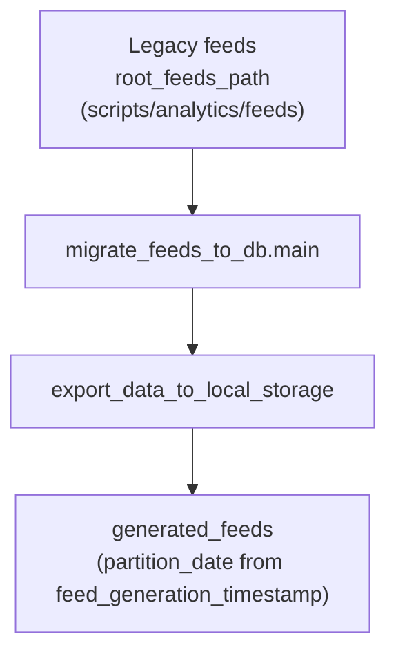
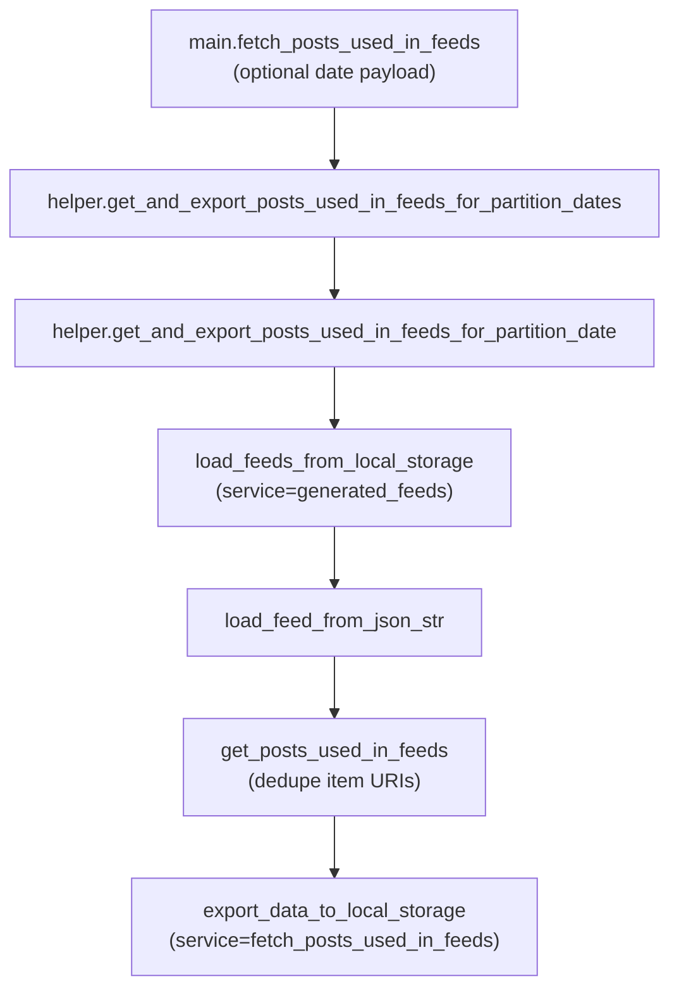
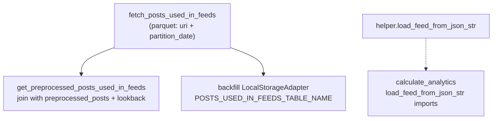

# Fetch posts used in feeds

## Purpose

For each feed generation day, derives the set of post URIs that appeared in study feeds and writes them as parquet under the `fetch_posts_used_in_feeds` dataset. Upstream feeds must already be in `generated_feeds` (serialized JSON in the `feed` column, partition by day). Downstream, this table constrains which posts matter for preprocessing joins, backfill coordination, and analytics that should only consider in-feed content.

## Key Files

| File | Description |
|------|-------------|
| `helper.py` | Loads `generated_feeds` for a `partition_date`, parses `feed` JSON (including double-encoded strings via `load_feed_from_json_str`), collects unique `post["item"]` URIs, exports `PostInFeedModel` rows to local storage. Also exposes `get_and_export_posts_used_in_feeds_for_partition_dates` for date-range batch runs. |
| `models.py` | `PostInFeedModel`: `uri`, `partition_date`. |
| `main.py` | CLI-style entry: reads optional payload (`start_date`, `end_date`, `exclude_partition_dates`) and calls the batch export helper. |
| `migrate_feeds_to_db.py` | One-off migration: reads consolidated feeds at `constants.root_feeds_path` via `pd.read_parquet`, partitions by `feed_generation_timestamp`, exports into `generated_feeds`. Run before the main workflow if feeds are not yet in that store. |
| `constants.py` | `root_feeds_path` for the legacy feeds parquet (under `scripts/analytics/feeds`). |

## How the key files relate

The package is both a small batch job (`main.py`) and a library: other code imports `load_feed_from_json_str` to parse feed blobs consistently.

### Migrate legacy feeds into `generated_feeds`

### Export post URIs per day

### Downstream

Dataset metadata (local prefix, S3, Glue) is registered in [`lib/db/service_constants.py`](../../lib/db/service_constants.py). Historical archive layout may appear as `archive_fetch_posts_used_in_feeds` in Terraform/Glue for the Nature paper study bucket.

## Other Files

| File | Description |
|------|-------------|
| `submit_main.sh` | SLURM job that runs `main.py` on the Quest-style cluster path. |
| `submit_migrate_feeds_to_db.sh` | SLURM job that runs `migrate_feeds_to_db.py`. |

## Related

- [`services/get_preprocessed_posts_used_in_feeds/`](../get_preprocessed_posts_used_in_feeds/) — preprocessed rows limited to posts that appear in `fetch_posts_used_in_feeds`.
- [`pipelines/backfill_records_coordination/README.md`](../../pipelines/backfill_records_coordination/README.md) — coordinates backfills and queueing; operators often run it after this dataset is populated.
- [`services/backfill/README.md`](../backfill/README.md) — backfill adapters load URIs from `fetch_posts_used_in_feeds`.
