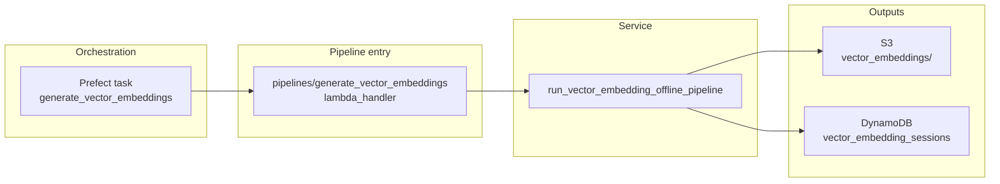
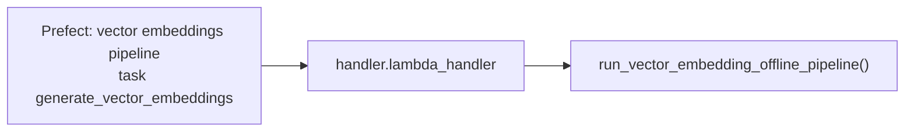
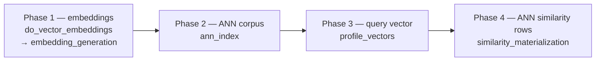
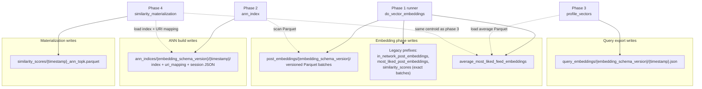
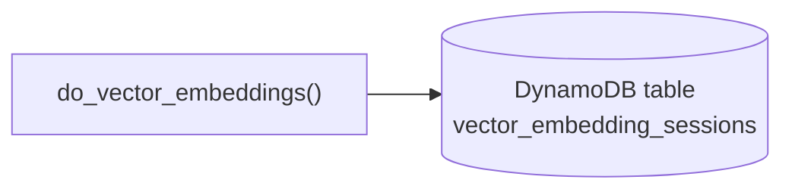

# Generate vector embeddings

## Purpose

Offline batch pipeline only. Computes Transformer embeddings for new preprocessed posts, writes versioned Parquet and legacy Athena-compatible artifacts to S3, rebuilds a FAISS corpus index from cached embeddings, exports a global query vector (most-liked centroid), and materializes ANN retrieval similarity rows still shaped as `PostSimilarityScoreModel` for Athena (`post_cosine_similarity_scores`).

## Key files

| File | Description |
| --- | --- |
| [`helper.py`](helper.py) | `do_vector_embeddings()`: preprocess-driven embed batch, legacy + versioned S3 writes, DynamoDB `vector_embedding_sessions`. `run_vector_embedding_offline_pipeline()`: embed stage → rebuild ANN from all versioned Parquet under schema prefix → export `QueryEmbeddingModel` JSON → write `{timestamp}_ann_topk.parquet` similarity rows. |
| [`embedding_generation.py`](embedding_generation.py) | Lazy `EmbeddingGenerator` (loads Torch/Transformers only when embedding runs); `get_device()` (CPU unless `VECTOR_EMBEDDINGS_REQUIRE_GPU`); L2-normalized vectors; idempotent URI discovery from versioned Parquet. |
| [`ann_index.py`](ann_index.py) | Load/combine embedding Parquet → FAISS Flat IP or HNSW inner-product; persist index blob + `uri_mapping.parquet` + `ann_index_session.json` under `vector_embeddings/ann_indices/`. |
| [`similarity_materialization.py`](similarity_materialization.py) | Numpy/FAISS-only: clamp scores to `[-1, 1]` (cosine on unit vectors); build `PostSimilarityScoreModel` rows (`most_liked_average_embedding_key` carries query artifact S3 key for backward-compatible semantics). |
| [`profile_vectors.py`](profile_vectors.py) | Global centroid `build_global_most_liked_centroid`, `global_centroid_to_query_embedding_model`; `build_user_profile_vector` reserved (NotImplemented). |
| [`models.py`](models.py) | `PostSimilarityScoreModel`, `PostEmbeddingModel`, `EmbeddingSessionModel`, `AnnIndexSessionModel`, `QueryEmbeddingModel`. |

## How the pieces relate

Overview below; the next four figures zoom into trigger chain, in-process phases, S3 layout, and DynamoDB bookkeeping.

### Overview



### Trigger and entrypoint



### Pipeline phases (control flow)

Linear order inside `run_vector_embedding_offline_pipeline()`. Phase 2 scans all versioned embedding Parquet under the active schema prefix. Phase 3 loads the latest average-most-liked Parquet and writes query JSON. Phase 4 loads the FAISS artifacts from phase 2 and reuses the same centroid vector in memory (see S3 artifact map).



### S3 artifact map (data plane)

Solid arrows are writes. Dashed edges are reads (scan versioned embedding Parquet for the corpus index, load average-most-liked Parquet for the centroid, load ANN index + URI mapping for search).



Phase 4 keeps `query_source_s3_key` pointing at the phase 3 JSON for row metadata; it does not re-read that JSON to score posts.

### Session bookkeeping

Written during the embedding phase only (`do_vector_embeddings`), not by ANN rebuild or materialization.



## S3 layout (high level)

| Prefix | Role |
| --- | --- |
| `post_embeddings/{embedding_schema_version}/` | Versioned batches with `embedding_model_revision`, `embedding_schema_version` (ANN rebuild scans all Parquet here). |
| `in_network_post_embeddings/`, `most_liked_post_embeddings/`, `similarity_scores/`, `average_most_liked_feed_embeddings/` | Legacy Glue/Athena compatibility (exact per-batch cosine rows still written where applicable). |
| `similarity_scores/{timestamp}_ann_topk.parquet` | Large-scale ANN retrieval scores vs centroid (same Athena prefix as legacy rows). |
| `ann_indices/...` | Serialized FAISS index + URI order mapping + session JSON. |
| `query_embeddings/...` | `QueryEmbeddingModel` JSON for the centroid used for ANN materialization. |

## Environment variables

| Variable | Effect |
| --- | --- |
| `VECTOR_EMBEDDINGS_REQUIRE_GPU` | When truthy, fail if neither CUDA nor MPS is available. |
| `HF_EMBEDDING_MODEL_REVISION` | Hugging Face revision for `bert-base-uncased` (default `main`). |
| `VECTOR_EMBEDDING_ANN_TOP_K` | Cap on neighbours retrieved per ANN materialization pass (default `100000`). |

## Related

- [`pipelines/generate_vector_embeddings/README.md`](../../pipelines/generate_vector_embeddings/README.md) — handler-focused execution notes.
- [`services/consolidate_enrichment_integrations/README.md`](../consolidate_enrichment_integrations/README.md) — merges Athena similarity rows into enriched posts.
- [`services/rank_score_feeds/`](../rank_score_feeds/README.md) — consumes `similarity_score` as likeability fallback.

## Tests

```bash
uv run pytest services/generate_vector_embeddings/tests -v
```

## Operators

See [`docs/runbooks/services/generate_vector_embeddings.md`](../../docs/runbooks/services/generate_vector_embeddings.md).
