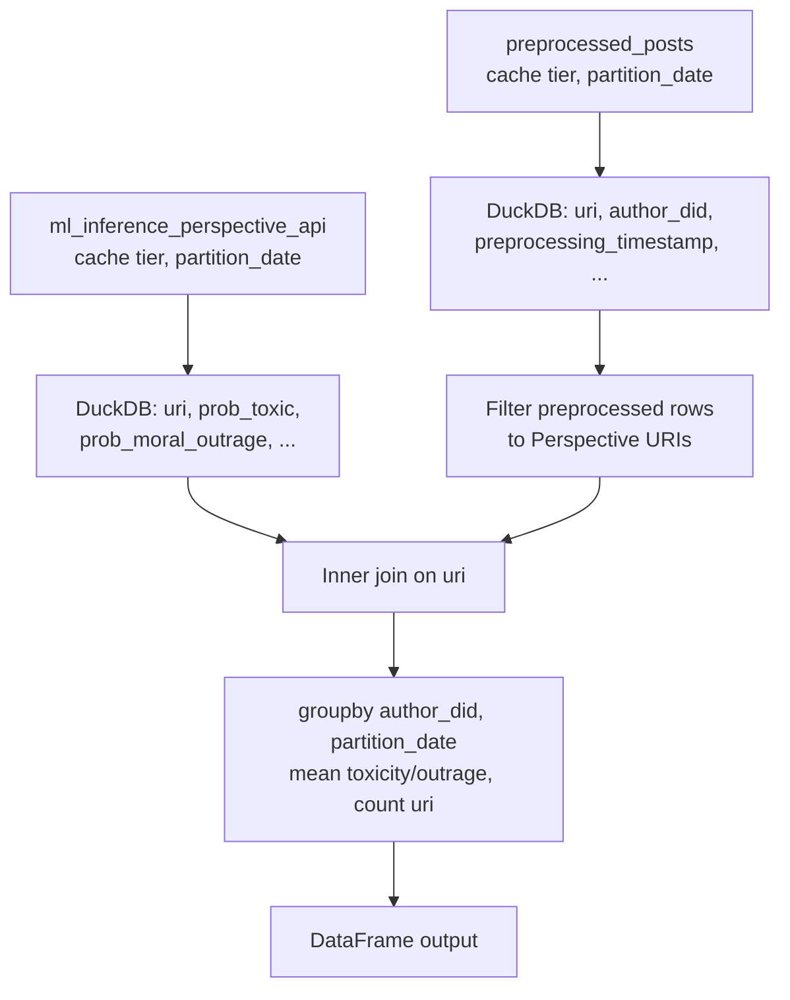
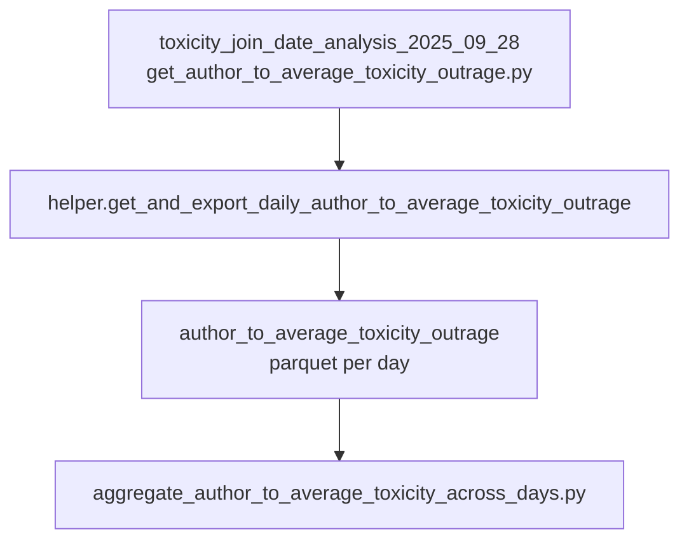

# Get author to average toxicity / outrage

## Purpose

For a single `partition_date`, joins Perspective API toxicity and moral-outrage scores (`ml_inference_perspective_api`) with `preprocessed_posts` on `uri`, then aggregates to one row per `author_did` with mean `prob_toxic`, mean `prob_moral_outrage`, and a count of labeled posts. Exports the result to the `author_to_average_toxicity_outrage` dataset (parquet via `export_data_to_local_storage`). This supports study analytics that need author-level toxicity/outrage aligned with preprocessing and Perspective labels.

## Key Files

| File | Description |
|------|-------------|
| `helper.py` | `get_author_to_average_toxicity_outrage(partition_date)` loads labeled posts and preprocessed rows for that day, inner-joins on `uri`, groups by `author_did` and `partition_date`, and returns `author_did`, `preprocessing_timestamp` (first in group), `total_labeled_posts`, `average_toxicity`, `average_outrage`. `get_and_export_author_to_average_toxicity_outrage_for_partition_date` writes parquet under `service_name` (`author_to_average_toxicity_outrage`). `get_and_export_daily_author_to_average_toxicity_outrage` fans out over many dates in `sequential` or `parallel` mode (thread pool). |

## How the key files relate

The package is a library plus batch helpers; production-style daily runs for the toxicity join-date study live under `calculate_analytics/analyses/toxicity_join_date_analysis_2025_09_28/` (see Other Files).

### Per-day aggregation



### Export and multi-day execution

```mermaid
flowchart TB
  ONE["get_and_export_author_to_average_toxicity_outrage_for_partition_date"]
  COMP["get_author_to_average_toxicity_outrage"]
  EXP["export_data_to_local_storage<br/>service=author_to_average_toxicity_outrage"]
  DAILY["get_and_export_daily_author_to_average_toxicity_outrage"]
  SEQ["get_and_export_daily_author_to_average_toxicity_outrage_sequential"]
  PAR["get_and_export_daily_author_to_average_toxicity_outrage_parallel"]

  ONE --> COMP
  COMP --> EXP
  DAILY --> SEQ
  DAILY --> PAR
  SEQ --> ONE
  PAR --> ONE
```



### Downstream analysis



Dataset metadata is registered in [`lib/db/service_constants.py`](../../lib/db/service_constants.py) under `author_to_average_toxicity_outrage` (primary key `author_did`, timestamp field `preprocessing_timestamp`).

## Other Files

| File / location | Description |
|-----------------|-------------|
| [`services/calculate_analytics/analyses/toxicity_join_date_analysis_2025_09_28/get_author_to_average_toxicity_outrage.py`](../../services/calculate_analytics/analyses/toxicity_join_date_analysis_2025_09_28/get_author_to_average_toxicity_outrage.py) | Thin `main`: builds partition dates from study constants and calls `get_and_export_daily_author_to_average_toxicity_outrage(..., mode="sequential")`. |
| [`services/calculate_analytics/analyses/toxicity_join_date_analysis_2025_09_28/README.md`](../../services/calculate_analytics/analyses/toxicity_join_date_analysis_2025_09_28/README.md) | Full study workflow, including SLURM scripts that invoke the wrapper. |

## Related

- [`services/ml_inference/README.md`](../../services/ml_inference/README.md) — Perspective scores are produced by the ML inference pipeline and stored in `ml_inference_perspective_api`.
- [`services/preprocess_raw_data/README.md`](../../services/preprocess_raw_data/README.md) — upstream of `preprocessed_posts`.

## Tests

```bash
uv run pytest services/get_author_to_average_toxicity_outrage/tests -v --import-mode=importlib
```
