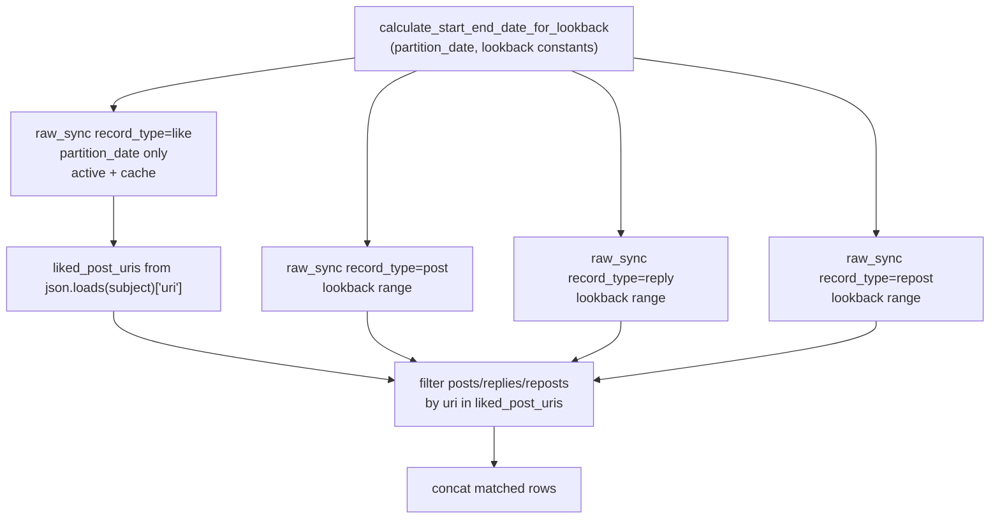
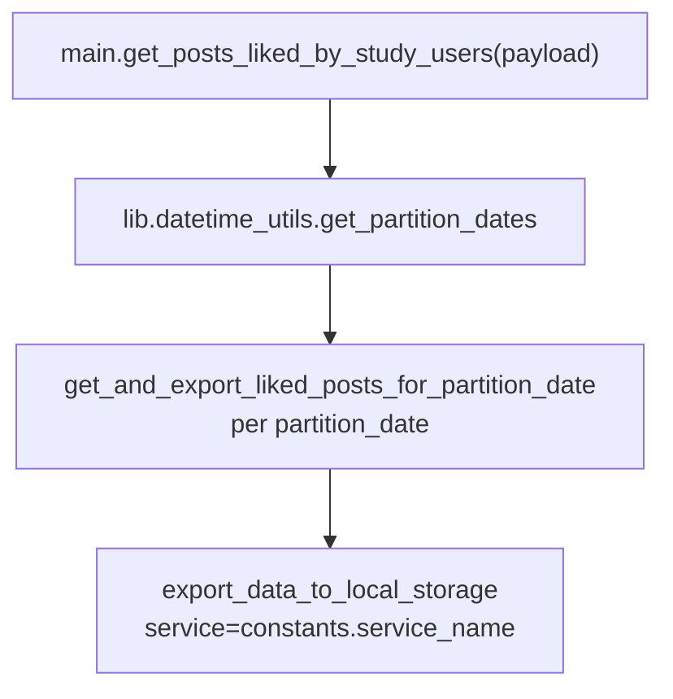
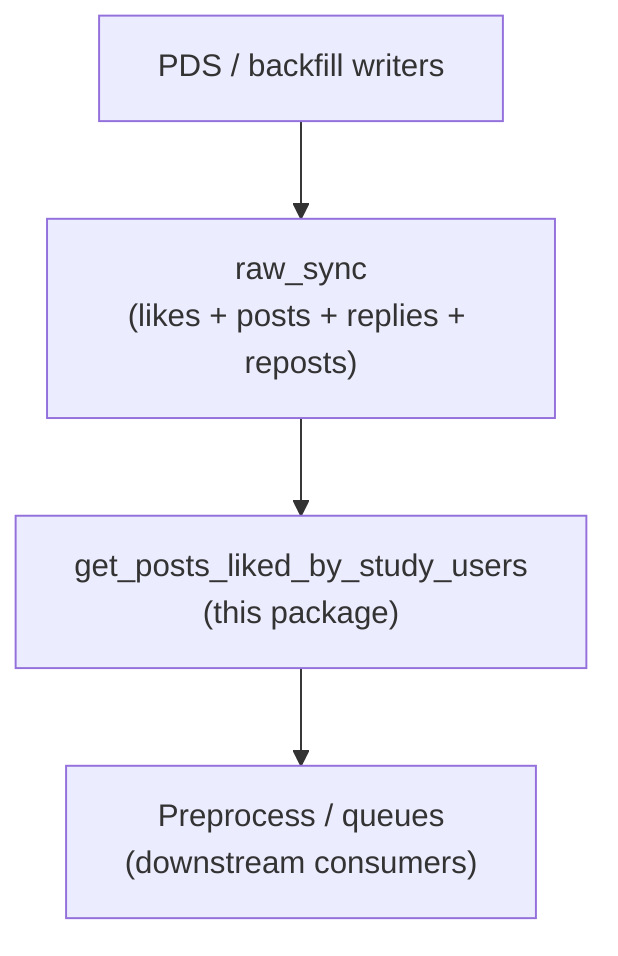

# Get posts liked by study users

## Purpose

For each `partition_date`, loads `like` records from `raw_sync` for that day (study PDS backfill outputs), derives liked post URIs from the `subject` field, then loads `post`, `reply`, and `repost` records from `raw_sync` over a configurable lookback window and keeps rows whose `uri` appears in that like set. The matched raw records are intended for export as a dedicated dataset (`service_name` in `constants.py`, currently `get_posts_liked_by_study_users`) so preprocessing can target content users actually liked. Lookback defaults (`default_num_days_lookback`, `default_min_lookback_date`) align with other study helpers that reuse the same date-window logic.

## Key Files

| File | Description |
|------|-------------|
| `constants.py` | `service_name`, `default_num_days_lookback` (10), `default_min_lookback_date` (`2024-09-28`). |
| `helper.py` | Loads `raw_sync` likes/posts/replies/reposts (`active` + `cache`); `load_raw_posts_for_likes_from_partition_date` computes lookback via `calculate_start_end_date_for_lookback`, filters and concatenates matched records; `get_and_export_liked_posts_for_partition_date` exports one day; `get_and_export_liked_posts_for_partition_dates` iterates a date range. |
| `main.py` | Payload-driven entry: `start_date`, `end_date`, `exclude_partition_dates` → `get_and_export_liked_posts_for_partition_dates`. |

## How the key files relate

Upstream data is `raw_sync` with `custom_args={"record_type": "like"|"post"|"reply"|"repost"}`. Lookback windowing uses `calculate_start_end_date_for_lookback` from `services.backfill.posts_used_in_feeds.load_data` (same import pattern as [`get_preprocessed_posts_used_in_feeds`](../get_preprocessed_posts_used_in_feeds/helper.py)); the date math is implemented in [`lib/datetime_utils.py`](../../lib/datetime_utils.py).

### Match likes to raw records for one day

### Batch export via `main.py`

### Placement in the study stack

Exports use [`export_data_to_local_storage`](../../lib/db/manage_local_data.py) with the `service` name from `constants.py`. That name must exist in [`MAP_SERVICE_TO_METADATA`](../../lib/db/service_constants.py) with a correct `timestamp_field` and `local_prefix` (raw rows typically use `synctimestamp`) so batching and paths resolve.

## Related

- [`services/backfill/README.md`](../backfill/README.md) — backfill and queue patterns; likes arrive via PDS-oriented sync.
- [`services/get_preprocessed_posts_used_in_feeds/helper.py`](../get_preprocessed_posts_used_in_feeds/helper.py) — same lookback helper module for feed-aligned preprocessing.
- [`lib/datetime_utils.py`](../../lib/datetime_utils.py) — `calculate_start_end_date_for_lookback`.
