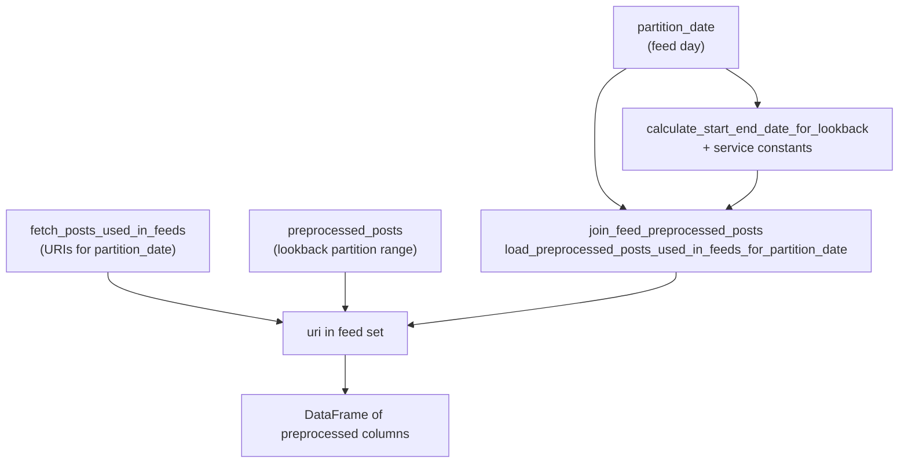
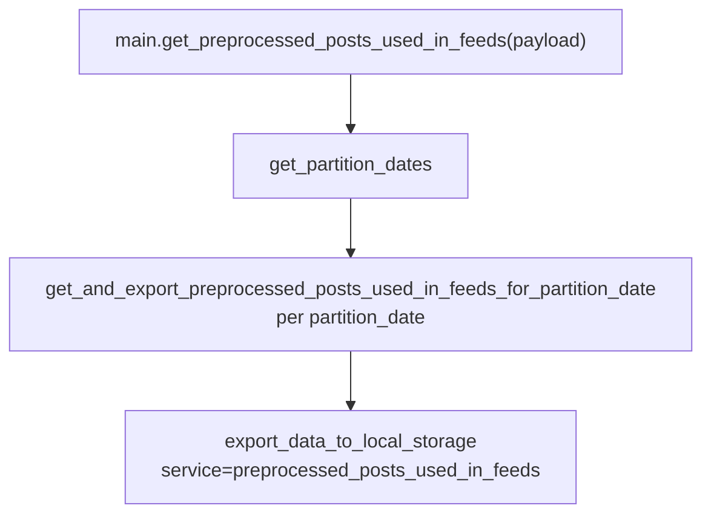
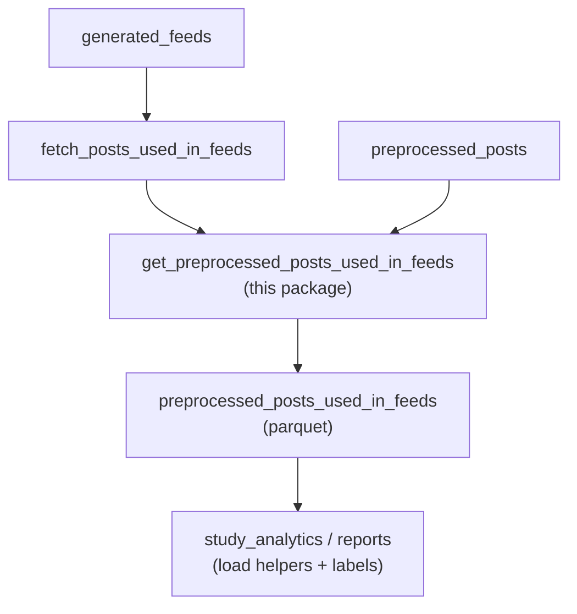

# Get preprocessed posts used in feeds

## Purpose

For each feed `partition_date` (the day posts appeared in study feeds), loads `preprocessed_posts` rows whose `uri` intersects the URIs from `fetch_posts_used_in_feeds` for that day, using a lookback window over calendar partitions so delayed preprocessing still matches in-feed content. Exports the result as parquet under the `preprocessed_posts_used_in_feeds` dataset. The same logical post can appear on multiple partition dates when it remains in the candidate pool across feed-generation days, so downstream consumers should not assume global uniqueness by `uri` without deduplicating if needed.

## Key Files

| File | Description |
|------|-------------|
| [`join_feed_preprocessed_posts.py`](join_feed_preprocessed_posts.py) | `load_posts_used_in_feeds_from_storage`, `load_preprocessed_posts_used_in_feeds_for_partition_date`: loads `fetch_posts_used_in_feeds` (active + cache), loads `preprocessed_posts` over a lookback range (DuckDB column projection when `table_columns` is set), intersects on `uri`, optional dedupe by `preprocessing_timestamp`. |
| [`constants.py`](constants.py) | `default_num_days_lookback` (from `FEED_LOOKBACK_DAYS_DURING_STUDY`) and `default_min_lookback_date` for service helpers. |
| [`helper.py`](helper.py) | Computes lookback via `calculate_start_end_date_for_lookback` from [`lib/datetime_utils.py`](../../lib/datetime_utils.py), calls the join module, exports via `export_data_to_local_storage` (`service="preprocessed_posts_used_in_feeds"`). |
| [`main.py`](main.py) | Payload entry: `start_date`, `end_date`, `exclude_partition_dates` to batch helper. |

## How the key files relate

### Resolve preprocessed rows for one feed day

### Batch export via `main.py`

### Placement in the feed analysis stack

Dataset metadata lives in [`MAP_SERVICE_TO_METADATA`](../../lib/db/service_constants.py) under `preprocessed_posts_used_in_feeds` (including `timestamp_field` for partitioning exports).

Export partitioning follows the service metadata: each batch run writes for the requested feed `partition_date`; row content comes from `preprocessed_posts`, so timestamps such as `preprocessing_timestamp` reflect preprocessing time rather than feed ordering.

## Other Files

| File | Description |
|------|-------------|
| `submit_job.sh` | SLURM wrapper that runs `main.py` on the Quest-style cluster path. |
| `tests/test_join_feed_preprocessed_posts.py` | Unit tests for the join module (storage loads, URI filter, dedupe, DuckDB projection). |
| `tests/test_preprocessed_posts_helper.py` | Unit tests for helper export and date-range behavior. |
| `tests/test_main.py` | Unit tests for payload forwarding into the batch helper. |
