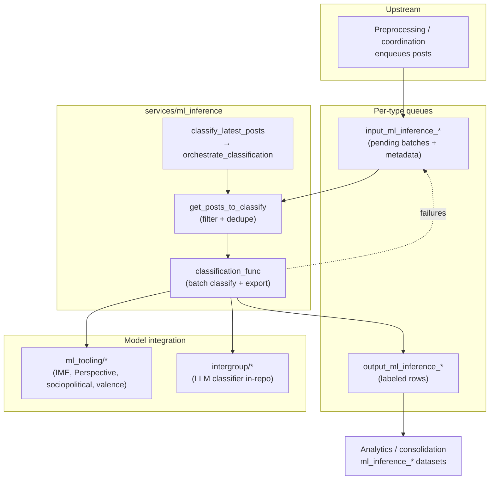
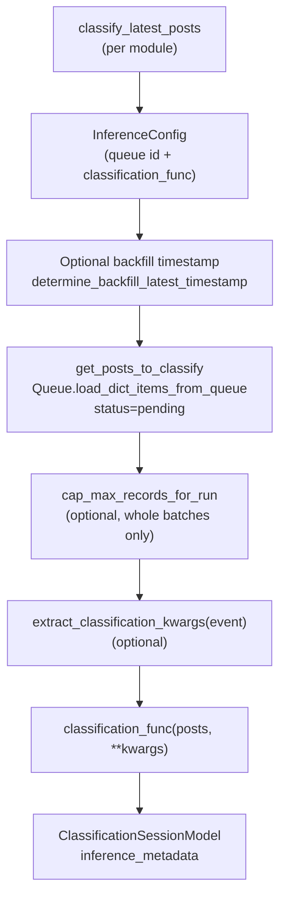
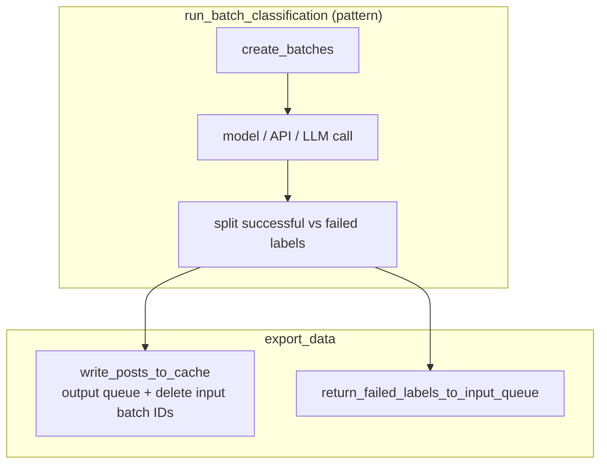

# ML inference

## Purpose

This package runs batch ML classification jobs over preprocessed posts.

## Key files

| File | Description |
|------|-------------|
| `helper.py` | `get_posts_to_classify()` loads pending queue payloads into `PostToLabelModel`; `cap_max_records_for_run()` limits work by whole `batch_id` groups; `orchestrate_classification()` drives backfill timestamps, classification, and `ClassificationSessionModel` results. |
| `config.py` | `QueueInferenceType` literal and `InferenceConfig` (inference id, queue id, `classification_func`, optional `extract_classification_kwargs` from Lambda/event payloads). |
| `models.py` | Shared contracts: `PostToLabelModel`, `LabelWithBatchId`, per-service label models, `ClassificationSessionModel`, `BatchClassificationMetadataModel`. |
| `export_data.py` | Maps inference type → queue names; `write_posts_to_cache()` moves successes to output queue and deletes processed batch IDs from input; `return_failed_labels_to_input_queue()` re-enqueues failures; helpers to attach `batch_id` to label dicts. |
| `{ime,perspective_api,sociopolitical,valence_classifier}/…` | Thin `classify_latest_posts()` entrypoints wrapping `orchestrate_classification` + `InferenceConfig`; batch logic in `ml_tooling/`. |
| `intergroup/…` | Intergroup LLM classifier, batching adapter, and `classify_latest_posts()` entrypoint (implementation stays in this repo). |

## Inference modules

| Module | README |
|--------|--------|
| IME (intergroup / moral / emotion) | [`ime/README.md`](./ime/README.md) |
| Intergroup (LLM) | [`intergroup/README.md`](./intergroup/README.md) |
| Perspective API | [`perspective_api/README.md`](./perspective_api/README.md) |
| Sociopolitical (LLM) | [`sociopolitical/README.md`](./sociopolitical/README.md) |
| Valence (VADER) | [`valence_classifier/README.md`](./valence_classifier/README.md) |

## How the key files relate

### End-to-end (all inference types)

### Shared orchestration flow

### Queue lifecycle inside `classification_func`

