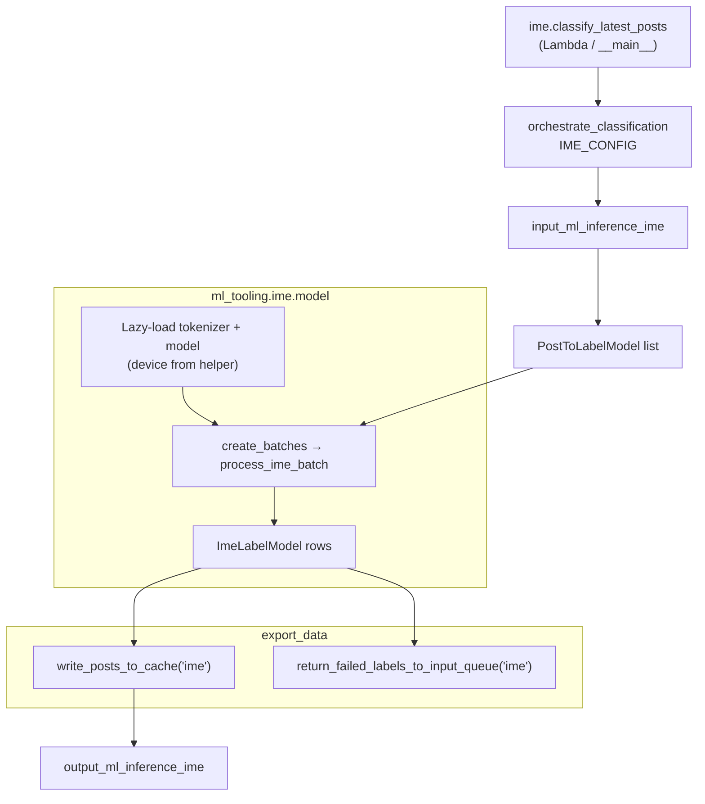

# IME classification

## Purpose

Scores preprocessed post text with an IME (intergroup, moral, emotion) neural classifier. See [this paper](https://static1.squarespace.com/static/5d8c8bd71a675f21
0c9996e6/t/653115d54b12c2193e9a6cce/1697715670585/PIIS13
64661323001663.pdf) for more details.

## Key files

| File | Description |
|------|-------------|
| `ime.py` | `IMEConfig` merges optional event `hyperparameters` with `ml_tooling.ime.constants.default_hyperparameters`; `classify_latest_posts()` calls `orchestrate_classification` with `ml_tooling.ime.model.run_batch_classification`. |
| `constants.py` | Local or `/tmp` cache path for model artifacts; `ime_root_s3_key` aligned with `ml_inference_ime` dataset naming. |

## Core logic

