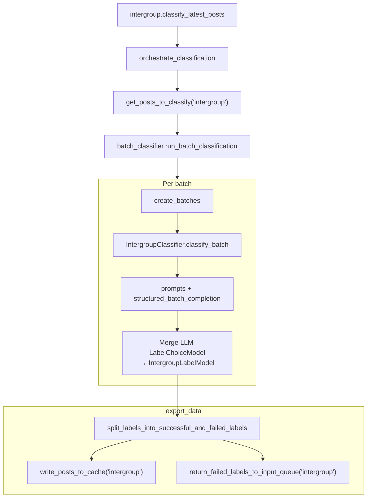

# Intergroup LLM classifier

## Purpose

Labels posts for intergroup content using a structured LLM completion (via `ml_tooling.llm.llm_service`).

## Key files

| File | Description |
|------|-------------|
| `intergroup.py` | `INTERGROUP_CONFIG` + `classify_latest_posts()` → `orchestrate_classification`. |
| `batch_classifier.py` | `run_batch_classification`: batches `PostToLabelModel`, runs `IntergroupClassifier.classify_batch`, splits success/failure, drives `write_posts_to_cache` / `return_failed_labels_to_input_queue`. |
| `classifier.py` | `IntergroupClassifier`: builds prompts (`prompts.py` / LLM utils), `structured_batch_completion` into `LabelChoiceModel`, merges responses with input URIs, maps errors to failed labels. |
| `models.py` | `IntergroupLabelModel`, `LabelChoiceModel`, and related Pydantic types for LLM output. |
| `constants.py` | Default batch size and LLM model name for production runs. |

## Core logic

