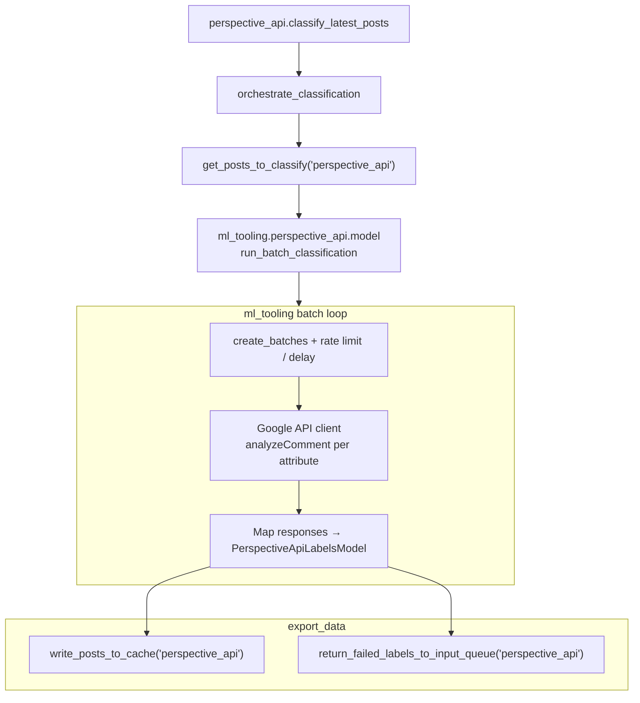

# Perspective API

## Purpose

Calls Google Perspective API (`commentanalyzer`) attributes (toxicity, insult, experimental construct scores, etc.) for each post.

## Key files

| File | Description |
|------|-------------|
| `perspective_api.py` | `PERSPECTIVE_API_CONFIG` + `classify_latest_posts()` → `orchestrate_classification` with `ml_tooling.perspective_api.model.run_batch_classification`. |
| `constants.py` | Cache directory (local vs Lambda `/tmp`); root S3 key name for the `ml_inference_perspective_api` dataset family. |

## Core logic

