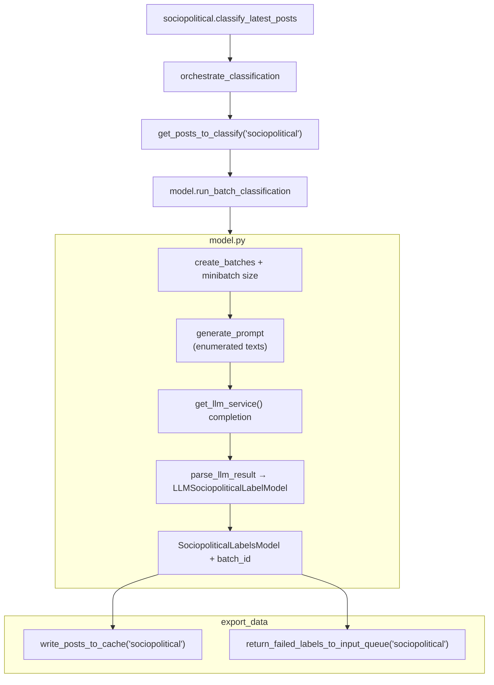

# Sociopolitical LLM classification

## Purpose

Uses an LLM to decide whether text is sociopolitical (politics or broad social issues) and, when yes, a coarse US political lean label (`left` / `right` / `moderate` / `unclear`). Implementation is in `services/ml_inference/sociopolitical/model.py` (prompting, JSON parsing, batching); `sociopolitical.py` is the orchestration entry.

## Key files

| File | Description |
|------|-------------|
| `sociopolitical.py` | `SOCIOPOLITICAL_CONFIG` + `classify_latest_posts()` → `orchestrate_classification` + `run_batch_classification`. |
| `model.py` | `generate_prompt`, `parse_llm_result`, minibatching via `ml_tooling.llm.llm_service`, `create_batches`, export through `write_posts_to_cache` / `return_failed_labels_to_input_queue`. |
| `constants.py` | Cache path and S3 root key for `ml_inference_sociopolitical`. |

## Core logic

