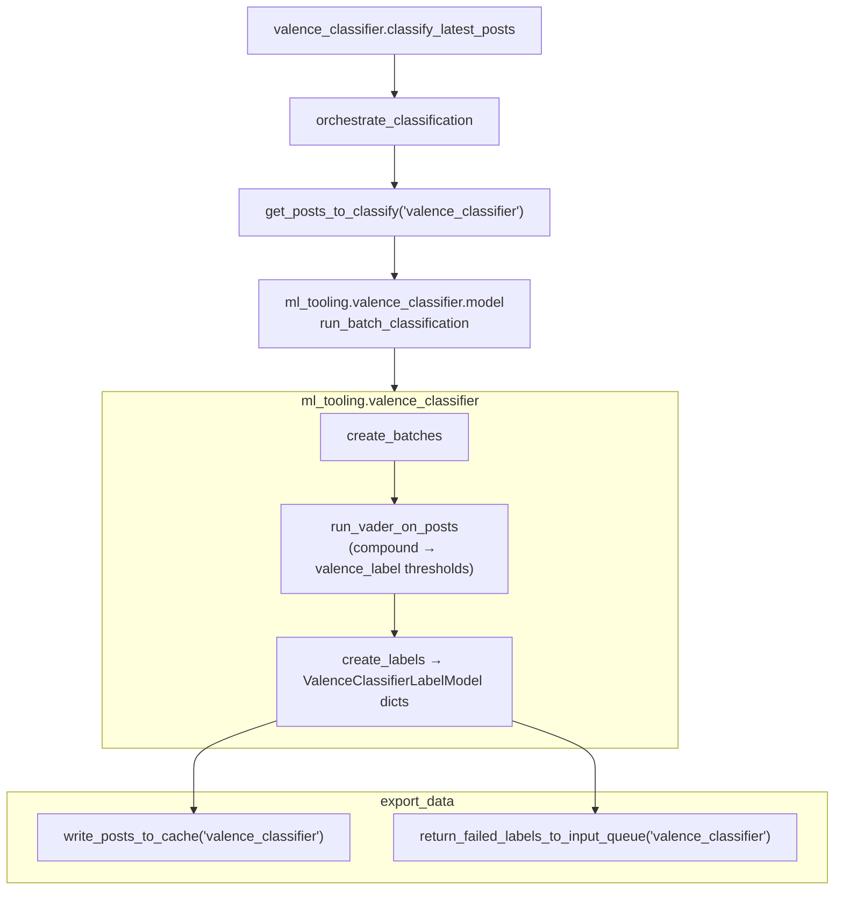

# Valence classifier (VADER)

## Purpose

Assigns positive / neutral / negative valence (and compound score) using the [VADER](https://github.com/cjhutto/vaderSentiment) rule-based sentiment model.

## Key files

| File | Description |
|------|-------------|
| `valence_classifier.py` | `VALENCE_CLASSIFIER_CONFIG` + `classify_latest_posts()` → `orchestrate_classification` with `ml_tooling.valence_classifier.model.run_batch_classification`. |

## Core logic

