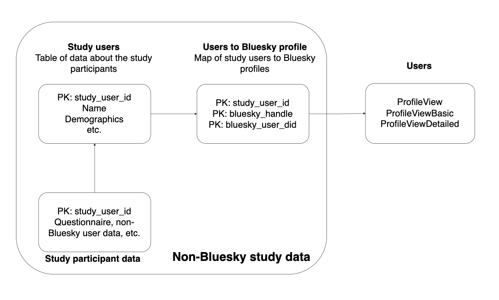

# Participant data

This service stores the non-Bluesky participant data (e.g., onboarding, questionnaires, etc.).

This service also maps the identifying information for our study users to their Bluesky handles and DIDs.

The following diagram shows how the data in this service relates to the Bluesky user data:



The functionality is in the main.py file:
```{python}
python main.py
```