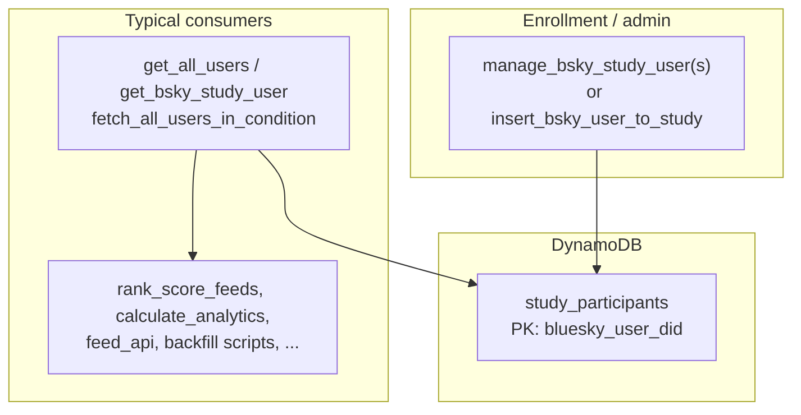
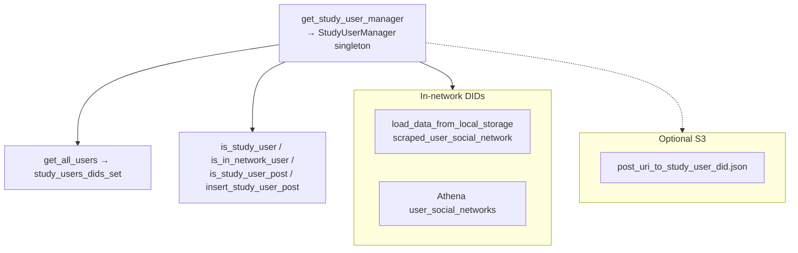
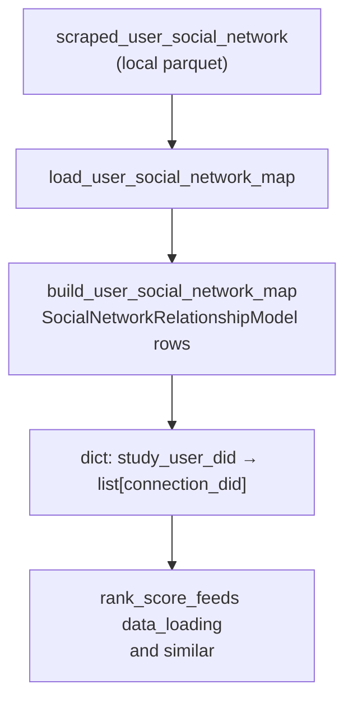
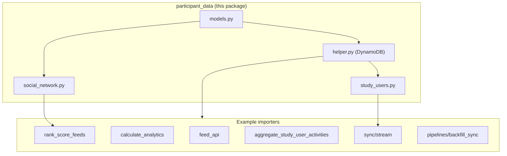

# Participant data

## Purpose

Canonical study roster and helpers around it. The live source of truth for enrolled users is the DynamoDB table `study_participants` (keys and fields shaped as `UserToBlueskyProfileModel`). This package is a library, not a standalone deployed service: ingestion, feed ranking, analytics, streaming, and ops scripts import it to resolve who counts as a study participant, their experiment condition, and (via related modules) social context used for filtering and personalization.

## Key files

| File | Description |
|------|-------------|
| `models.py` | `UserToBlueskyProfileModel` (study_user_id, bluesky_handle, bluesky_user_did, condition, is_study_user, created_timestamp); `SocialNetworkRelationshipModel` for follow/follower edges; request/operation helpers for admin-style APIs. |
| `helper.py` | DynamoDB client for `study_participants`: insert/update/delete/get, `get_all_users()` (full table scan, optional `test_mode` filter via `TEST_USER_HANDLES`), `fetch_all_users_in_condition`, and `manage_bsky_study_user(s)` for POST/GET/DELETE payloads. |
| `study_users.py` | `StudyUserManager` singleton: loads study DIDs from `get_all_users()`, loads in-network DIDs from local `scraped_user_social_network` or Athena `user_social_networks`, optional S3 map `participant_data/post_uri_to_study_user_did.json` for attributing posts to study users during streaming. |
| `social_network.py` | `load_user_social_network_map()` reads `scraped_user_social_network` from local storage and returns `study_user_did → connection_dids` via `build_user_social_network_map`. |
| `tests/` | Unit tests (e.g. social network parsing). |

## How the key files relate

This package is imported by many services; the two main usage patterns are “load the roster” and “stream setup + social graph.”

### Study roster (DynamoDB)

```mermaid
flowchart TB
  subgraph write ["Enrollment / admin"]
    API["manage_bsky_study_user(s)<br/>or insert_bsky_user_to_study"]
  end

  subgraph store ["DynamoDB"]
    T["study_participants<br/>PK: bluesky_user_did"]
  end

  subgraph read ["Typical consumers"]
    GA["get_all_users / get_bsky_study_user<br/>fetch_all_users_in_condition"]
    DOWN["rank_score_feeds, calculate_analytics,<br/>feed_api, backfill scripts, ..."]
  end

  API --> T
  GA --> T
  GA --> DOWN
```

### Streaming: `StudyUserManager`

Used when the firehose pipeline needs fast membership checks and optional post URI attribution (see `services/sync/stream` setup).

```mermaid
flowchart TB
  MGR["get_study_user_manager<br/>→ StudyUserManager singleton"]
  DDB["get_all_users → study_users_dids_set"]

  subgraph net ["In-network DIDs"]
    LOC["load_data_from_local_storage<br/>scraped_user_social_network"]
    ATH["Athena user_social_networks"]
  end

  subgraph s3opt ["Optional S3"]
    MAP["post_uri_to_study_user_did.json"]
  end

  MGR --> DDB
  MGR --> net
  MGR -.-> s3opt

  CHK["is_study_user / is_in_network_user /<br/>is_study_user_post / insert_study_user_post"]
  MGR --> CHK
```

### Feed / analytics: social network map

```mermaid
flowchart TB
  SN["scraped_user_social_network<br/>(local parquet)"]
  LOAD["load_user_social_network_map"]
  BUILD["build_user_social_network_map<br/>SocialNetworkRelationshipModel rows"]
  OUT["dict: study_user_did → list[connection_did]"]

  SN --> LOAD
  LOAD --> BUILD
  BUILD --> OUT
  OUT --> FEED["rank_score_feeds data_loading<br/>and similar"]
```

### End-to-end (library role)

```mermaid
flowchart TB
  subgraph pkg ["participant_data (this package)"]
    MOD["models.py"]
    H["helper.py (DynamoDB)"]
    SU["study_users.py"]
    SO["social_network.py"]
  end

  subgraph consumers ["Example importers"]
    RS["rank_score_feeds"]
    ANA["calculate_analytics"]
    FA["feed_api"]
    AGG["aggregate_study_user_activities"]
    STR["sync/stream"]
    BF["pipelines/backfill_sync"]
  end

  MOD --> H
  MOD --> SO
  H --> SU
  H --> consumers
  SU --> STR
  SO --> RS
```
