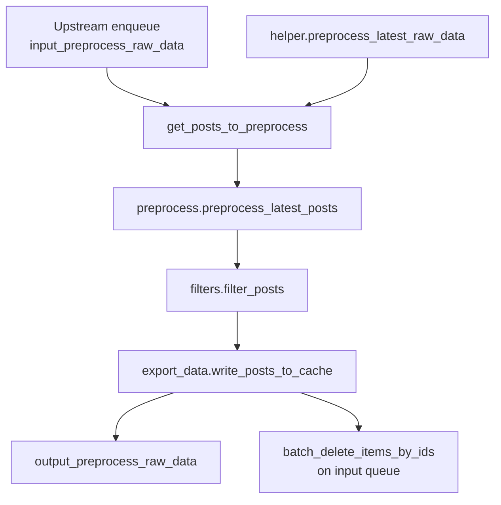
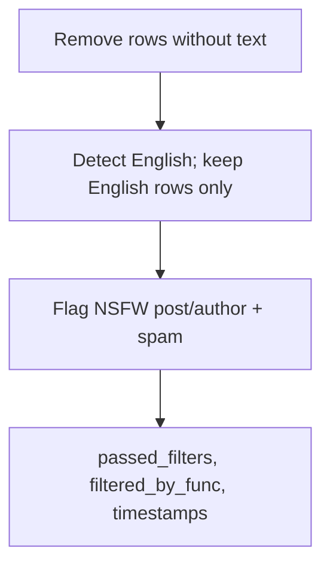
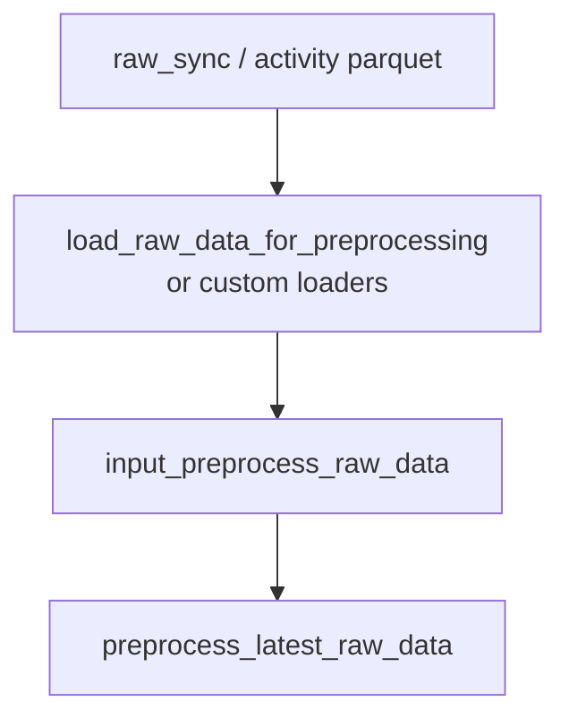
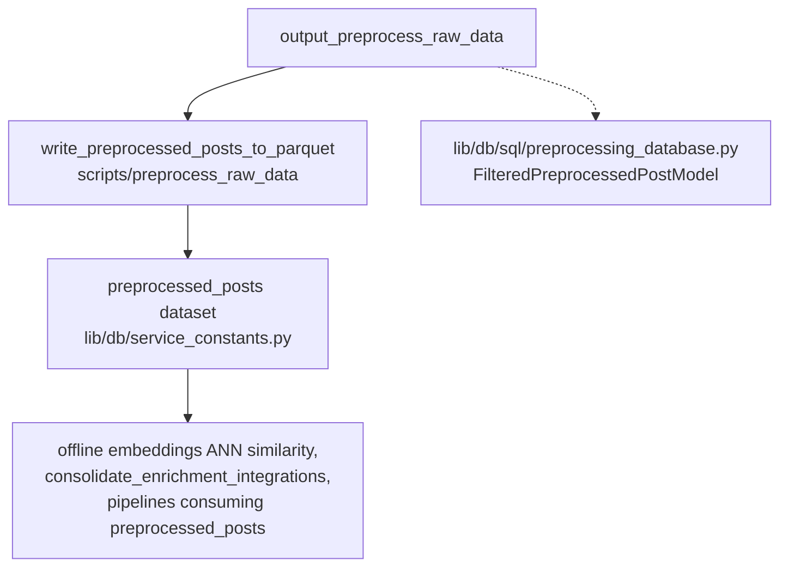

# Preprocess raw data

## Purpose

Turns consolidated Bluesky post records into enriched, filtered rows ready for analytics, parquet export, and downstream enrichment or model pipelines.

Pending posts sit on `input_preprocess_raw_data`, the job normalizes columns, runs language and safety filters, attaches `preprocessing_timestamp` / `passed_filters` (and related fields), then writes every surviving row to `output_preprocess_raw_data` and deletes the processed input batch IDs. Non-English posts are dropped before NSFW and spam scoring; posts that fail content checks remain in the batch with `passed_filters=False` so downstream can distinguish them.

## Key files

| File | Description |
|------|-------------|
| `helper.py` | `get_posts_to_preprocess()` reads pending payloads from `input_preprocess_raw_data`; `preprocess_latest_raw_data()` applies optional backfill window, builds `custom_args` from the Lambda `event` (e.g. alternate timestamp field), runs `preprocess_latest_posts`, returns session dict (`metadata` holds filter counts). |
| `preprocess.py` | `prepare_posts_for_preprocessing` (text cleanup, `author` → `author_did`), `filter_posts` from `filters.py`, `write_posts_to_cache` from `export_data.py`. |
| `filters.py` | Staged pipeline: drop empty text → English detection / keep English → NSFW (post + author) and spam flags → `passed_filters` + `filtered_by_func` → timestamps; returns DataFrame plus metadata for logging and session JSON. |
| `export_data.py` | `write_posts_to_cache`: batch-adds all labeled rows to `output_preprocess_raw_data`, deletes corresponding batch IDs from the input queue. |
| `load_data.py` | Offline utilities: load firehose or most-liked slices from local stores (`in_network_user_activity`, `study_user_activity`, `sync_most_liked_posts`), hydrate `ConsolidatedPostRecordModel`, read prior session hints from DynamoDB `preprocessingPipelineMetadata`. |
| `models.py` | `FilteredPreprocessedPostModel` (schema for filtered rows, used by SQLite and downstream services). |
| `classify_language/` | English-vs-not helpers used by `filters.py` (see subfolder README). |
| `classify_nsfw_content/` | Keyword / label / list based NSFW gates for post body and author. |
| `classify_spam/` | Spam heuristics on post text. |
| `update_bluesky_mute_lists/` | Separate maintenance tooling for mute lists (see subfolder README). |

## How the key files relate

### Queue pipeline (typical production run)

[`pipelines/preprocess_raw_data/handler.py`](../../pipelines/preprocess_raw_data/handler.py) invokes `preprocess_latest_raw_data` with optional backfill fields on the event payload.

### Filter stages

English filtering drops non-English rows entirely. NSFW and spam steps annotate the remaining rows; `passed_filters` is false if any content check fails (failed rows are still exported with flags).

### Offline ingest (scripts)

[`scripts/preprocess_raw_data/load_raw_data_for_preprocessing.py`](../../scripts/preprocess_raw_data/load_raw_data_for_preprocessing.py) can load `raw_sync` posts/replies for a partition date and push them onto `input_preprocess_raw_data` for the same worker path. `load_data.py` supports pulling historical activity parquet for ad hoc reprocessing or analysis.

### Downstream

