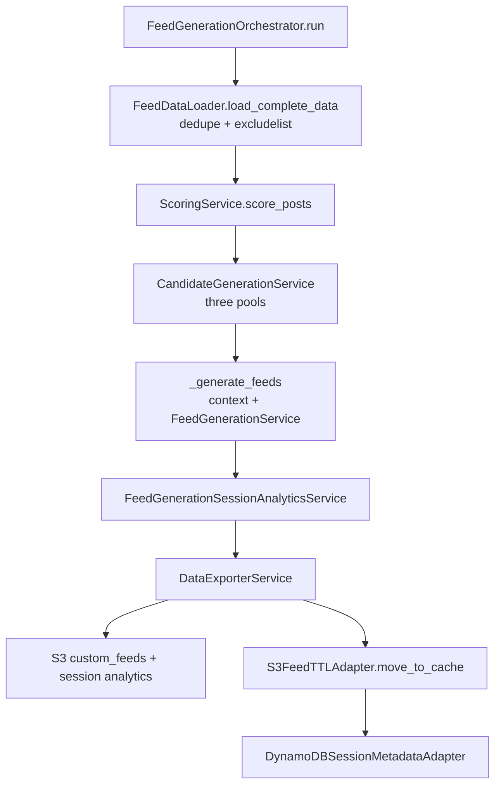
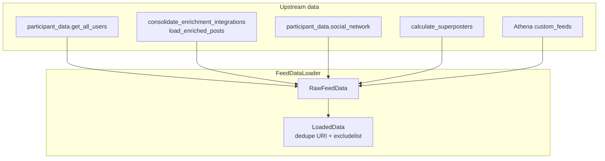
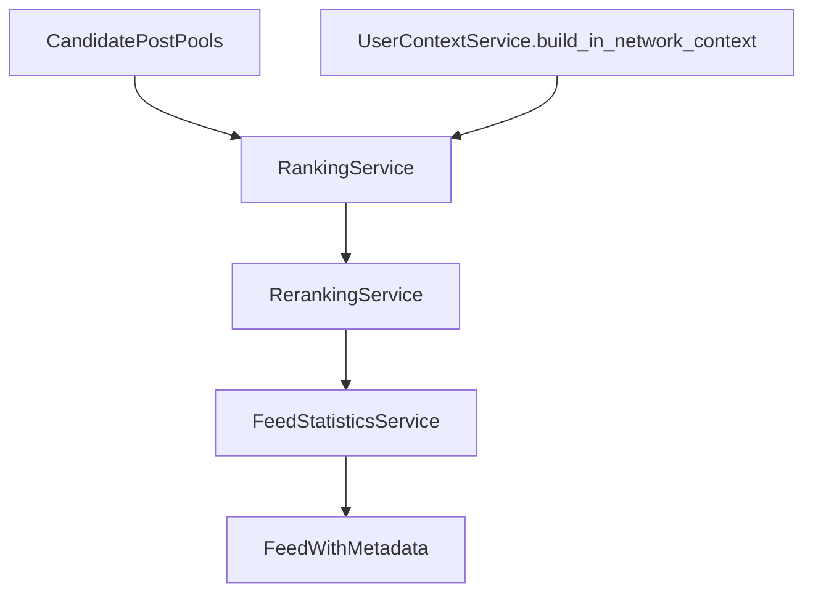
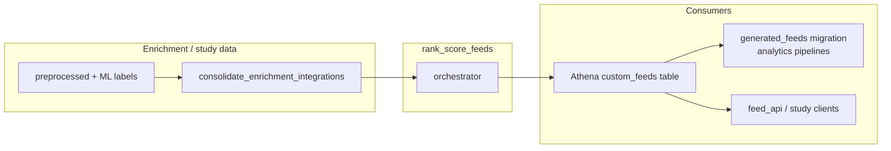

# Rank score feeds

## Purpose

Generates per-participant custom feeds for the study by scoring enriched posts, building three global candidate pools, then ranking and reranking per user based on their experiment condition and social graph. Artifacts are written for downstream consumption (Athena/Glue `custom_feeds`, session analytics, optional score cache under the `post_scores` dataset). `FeedGenerationOrchestrator` is the composition root: it wires services, repositories, and S3/DynamoDB adapters for a single end-to-end run.

Study conditions (from participant enrollment) select algorithm behavior when building each user feed:

- `reverse_chronological` — firehose posts ordered by sync time.
- `engagement` — posts ordered by engagement score (likeability plus freshness).
- `representative_diversification` — posts ordered by treatment score (engagement adjusted with Perspective-style toxicity/constructiveness signals and superposter damping).

## Key files

| File / area | Description |
|-------------|-------------|
| `orchestrator.py` | `FeedGenerationOrchestrator`: `run()` loads data, scores posts, builds `CandidatePostPools`, generates `FeedWithMetadata` per user, exports feeds and session analytics, TTLs old S3 prefixes, writes session metadata to DynamoDB. Skips TTL/metadata in `test_mode`. |
| `config.py` | `FeedConfig` dataclass: feed length, author caps, freshness decay, scoring coefficients, lookbacks, TTL `keep_count`, etc. |
| `models.py` | `LoadedData`, `CandidatePostPools`, `FeedWithMetadata`, `StoredFeedModel`, `LatestFeeds`, score/export structs. |
| `constants.py` | Service-level constants shared by scoring and routing. |
| `metrics.py` | Helpers to inspect or plot score distributions (analysis tooling). |
| `services/data_loading.py` | `FeedDataLoader` facade: `DataLoadingService` (users, enriched posts, social graph, superposters, latest feeds via Athena `custom_feeds`) plus `DataTransformationService` (optional dedupe by URI, manual excludelist authors). |
| `services/scoring.py` | `ScoringService`: merges cached `post_scores` with newly computed engagement/treatment scores, optional export via `ScoresRepository`. |
| `services/candidate.py` | `CandidateGenerationService`: author-frequency filter, three sorted pools (reverse chrono / engagement / treatment). |
| `services/context.py` | `UserContextService`: per-user in-network post URI sets from the social graph. |
| `services/ranking.py` | `RankingService`: initial ordering from the pool that matches the user condition, biasing in-network content. |
| `services/reranking.py` | `RerankingService`: preprocessing window, caps on stale posts, max feed length, jitter. |
| `services/feed.py` | `FeedGenerationService`: orchestrates rank → rerank → statistics for all users. |
| `services/feed_statistics.py` | Per-feed stats JSON. |
| `services/feed_generation_session_analytics.py` | Cross-user session summary for export and DynamoDB. |
| `services/export.py` | `DataExporterService`: maps feeds/analytics to storage payloads via `FeedStorageRepository`. |
| `repositories/scores_repo.py` | Loads/saves score cache from local `post_scores` parquet layout. |
| `repositories/feed_repo.py` | Repository over `FeedStorageAdapter` for writes. |
| `storage/` | Adapter interfaces (`base.py`), S3 feed writer + TTL + DynamoDB session metadata (`adapters.py`), `StorageError`. |
| `tests/` | Unit and integration coverage for orchestrator, services, repositories. |
| `experiments/` | Notebooks for score experiments. |

## How the key files relate

### Orchestrator pipeline



S3 writes happen inside `DataExporterService`. TTL and the DynamoDB session insert are separate calls in `run()`, skipped when `test_mode` is true.

### Data inputs



### Per-user feed construction



Condition selects which pool and ranking keys apply before reranking constraints (`FeedConfig` max length, max proportion of previously seen posts, in-network ratio, jitter).

### End-to-end placement



## Usage

```python
from services.rank_score_feeds.config import FeedConfig
from services.rank_score_feeds.orchestrator import FeedGenerationOrchestrator

orchestrator = FeedGenerationOrchestrator(feed_config=FeedConfig())
orchestrator.run(
    users_to_create_feeds_for=None,
    export_new_scores=True,
    test_mode=False,
)
```

## Tests

```bash
pytest services/rank_score_feeds/tests/
```
