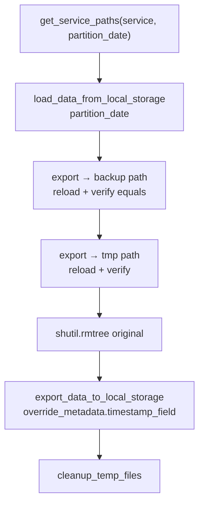
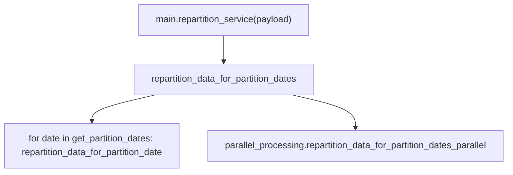

# Repartition service

## Purpose

Operator tooling to change how a dataset is partitioned on disk for services registered in [`MAP_SERVICE_TO_METADATA`](../../lib/db/service_constants.py). For each `partition_date`, it loads parquet under the service `local_prefix`, writes verified backup and temporary copies under `old_{basename(local_prefix)}` and `tmp_{basename(local_prefix)}` beneath [`root_local_data_directory`](../../lib/constants.py), removes the original hive-style folder, then re-exports the same rows through `export_data_to_local_storage` with an overridden `timestamp_field` so future writes use the new partition key (for example switching metadata from one timestamp column to `preprocessing_timestamp`).

This is not a continuously running service; it is invoked with an explicit payload (Lambda, script, or notebook) when migrating layout.

## Key files

| File | Description |
|------|-------------|
| `main.py` | `repartition_service(payload)`: validates `service`, date range, `new_service_partition_key`, `exclude_partition_dates`, `use_parallel`; delegates to `repartition_data_for_partition_dates`. |
| `helper.py` | Path helpers (`get_service_paths`), dataframe equality checks, per-date `repartition_data_for_partition_date` (load → backup → verify → temp → verify → delete original → export with new metadata), `repartition_data_for_partition_dates` (sequential loop or parallel delegate), `OperationResult` / status enums and errors. |
| `parallel_processing.py` | `repartition_data_for_partition_dates_parallel`: `ProcessPoolExecutor`, chunked dates, shared progress counter, timeouts, `recover_failed_chunks` with retries. |
| `tests/` | Unit tests for helper behavior, main wiring, and parallel paths. |

## How the key files relate

### Single partition date



Empty partitions short-circuit successfully without backup/delete.

### Date range entrypoints



`use_parallel: true` selects the parallel module; semantics per date stay the same.

### Path layout (per date)

| Role | Path pattern |
|------|----------------|
| Original | `{local_prefix}/cache/partition_date={date}` |
| Backup | `{root_local_data_directory}/old_{service_basename}/cache/partition_date={date}` |
| Temp | `{root_local_data_directory}/tmp_{service_basename}/cache/partition_date={date}` |

## Usage

```python
payload = {
    "start_date": "2024-01-01",
    "end_date": "2024-01-31",
    "service": "<MAP_SERVICE_TO_METADATA key>",
    "new_service_partition_key": "preprocessing_timestamp",
    "exclude_partition_dates": [],
    "use_parallel": False,
}
from services.repartition_service.main import repartition_service

repartition_service(payload)
```
