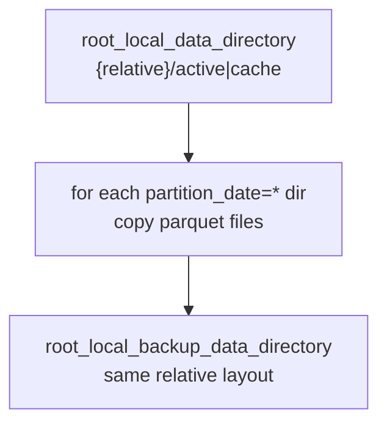
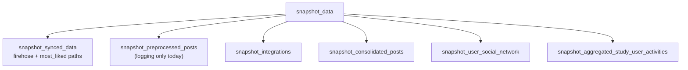

# Snapshot data

## Purpose

Copies selected local dataset trees from the active research directory to the backup root.

## Key files

| File | Description |
|------|-------------|
| `helper.py` | `migrate_directory_snapshot(relative_base_path, allow_overwrite=True)`; composite snapshots `snapshot_study_user_activity`, `snapshot_in_network_user_activity`, `snapshot_firehose_data`, `snapshot_most_liked_data`, `snapshot_synced_data`, `snapshot_integrations`, `snapshot_consolidated_posts`, `snapshot_user_social_network`, `snapshot_aggregated_study_user_activities`, and `snapshot_data()` which creates the backup root if missing then runs the checklist. |

## How the key files relate

### Directory mirror

### Full snapshot sequence

