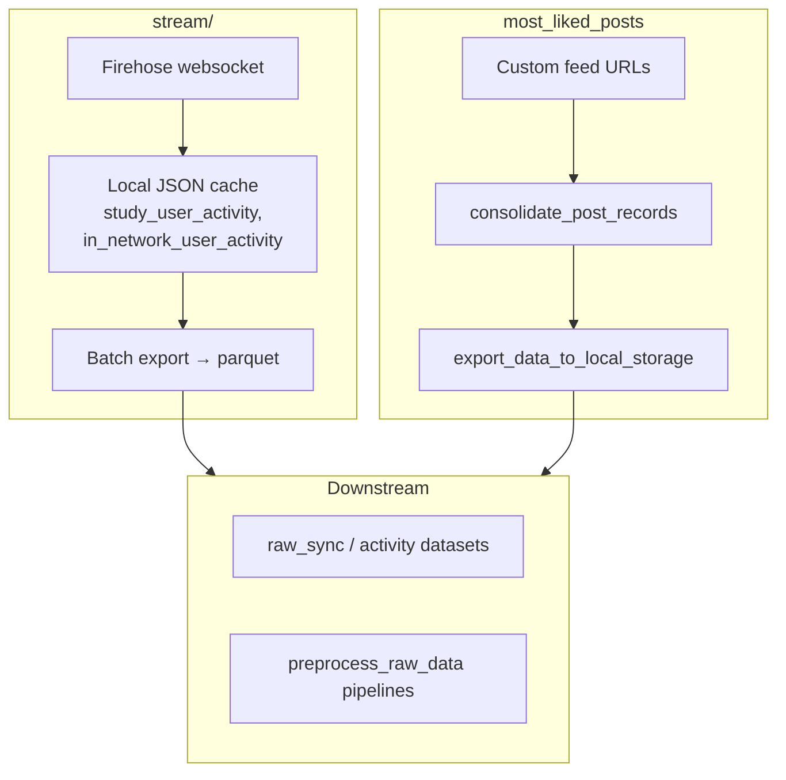

# Sync

## Purpose

Bluesky ingestion code paths: real-time or scheduled jobs that pull public network data and land it in this repo’s storage layout (JSON cache, parquet datasets, queues). The largest piece is the firehose stream under `stream/` (record routing, study vs in-network exporters, batch parquet export). Separate helpers sync curated “most liked” style feeds from custom feed URLs, and `search/` holds one-off scripts for using the Bluesky API directly for getting records (this doesn't scale well, hence the use of the firehose).

## Key areas

| Path | Description |
|------|-------------|
| `stream/` | Firehose client, cursor state, JSON cache layout, record processors (post/like/follow), `BatchExporter` / study and in-network activity exporters, storage adapters. Entry: `app.py`. |
| `most_liked_posts/helper.py` | Fetches `FeedViewPost` lists from configured custom feeds, consolidates via `consolidate_feedview_post`, filters English text, exports into the `sync_most_liked_posts` / related storage paths (see in-file `feed_to_info_map` and Glue/SQS integration). |
| `search/` | Bluesky search–driven sync. Not used in production but helpful to have for reference. |

## How the areas relate

