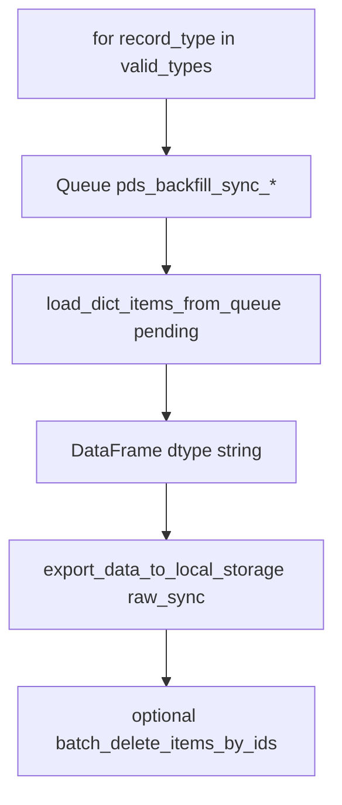

# Write cache buffers to DB

## Purpose

Drains durable-queue payloads into parquet-backed local storage layouts under the standard local storage conventions. The remaining entrypoint in this package is geared at backfill sync: flush every `pds_backfill_sync_<record_type>` queue into the `raw_sync` service with the appropriate `record_type` partition metadata.

Newer ML backfill flows that write integration output queues typically go through [`services/backfill/services/cache_buffer_writer_service.py`](../backfill/services/cache_buffer_writer_service.py) instead; this module is kept for backwards compatibility and small scripts.

## Key files

| File | Description |
|------|-------------|
| `helper.py` | `write_backfill_sync_queues_to_db(clear_queue=True)`: for each `record_type` in [`valid_types`](../backfill/pds_backfills/core/constants.py), open `Queue(f"{base_queue_name}_{record_type}")`, load all `pending` dict rows, build a string-typed `DataFrame`, `export_data_to_local_storage(service="raw_sync", custom_args={"record_type": ...})`, optionally `batch_delete_items_by_ids` using each row’s `batch_id`. Warns if `MAP_SERVICE_TO_METADATA["raw_sync"]["dtypes_map"][record_type]` expects non-string columns. |

## Flow

